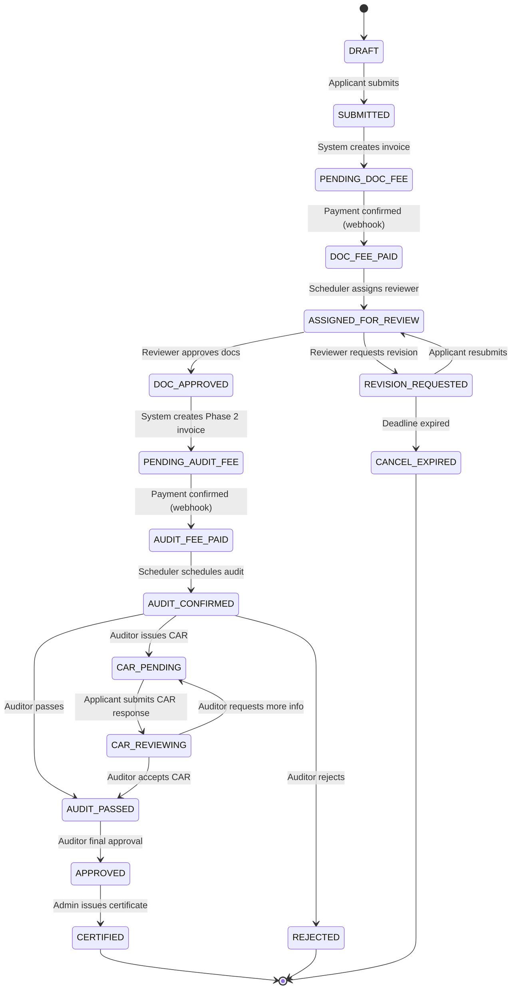

# Canonical Target Model — GACP Platform

> What the system SHOULD look like after normalization.
> This is the design target. Not aspirational — actionable.

---

## 1. Canonical Workflow State Machine



### 18 States — No change needed
The current workflow-transition-service.js is **already correct**.
It is the single source of truth. Everything else must project from it.

### Role-Owned Transitions (verified correct)

| From → To | Owner | Notes |
|-----------|-------|-------|
| DRAFT → SUBMITTED | health | Applicant submits form |
| SUBMITTED → PENDING_DOC_FEE | system | Auto-create invoice |
| PENDING_DOC_FEE → DOC_FEE_PAID | system/webhook | Payment confirmation |
| DOC_FEE_PAID → ASSIGNED_FOR_REVIEW | scheduler | Assign reviewer |
| ASSIGNED_FOR_REVIEW → DOC_APPROVED | document_reviewer / auditor | Approve docs |
| ASSIGNED_FOR_REVIEW → REVISION_REQUESTED | document_reviewer / auditor | Request revision |
| REVISION_REQUESTED → ASSIGNED_FOR_REVIEW | health | Resubmit after revision |
| REVISION_REQUESTED → CANCEL_EXPIRED | system | 5-day deadline |
| DOC_APPROVED → PENDING_AUDIT_FEE | system | Auto-create Phase 2 invoice |
| PENDING_AUDIT_FEE → AUDIT_FEE_PAID | system/webhook | Payment confirmation |
| AUDIT_FEE_PAID → AUDIT_CONFIRMED | scheduler | Schedule audit |
| AUDIT_CONFIRMED → AUDIT_PASSED | auditor | Pass audit |
| AUDIT_CONFIRMED → CAR_PENDING | auditor | Issue CAR |
| AUDIT_CONFIRMED → REJECTED | auditor | Reject |
| CAR_PENDING → CAR_REVIEWING | health | Submit CAR response |
| CAR_REVIEWING → AUDIT_PASSED | auditor | Accept CAR |
| CAR_REVIEWING → CAR_PENDING | auditor | Request more on CAR |
| AUDIT_PASSED → APPROVED | auditor | Final approval |
| APPROVED → CERTIFIED | admin | Issue certificate |

---

## 2. Canonical Dashboard Stage Model (8 stages)

The frontend 8-stage model is the CORRECT business projection.

```
Backend Workflow State          →  Dashboard Stage (Health User Sees)
─────────────────────────────────────────────────────────────────────
DRAFT                           →  DRAFT (ร่างคำขอ)
SUBMITTED, PENDING_DOC_FEE      →  PENDING_FEE_PHASE1 (รอชำระค่าธรรมเนียม ขั้นที่ 1)
DOC_FEE_PAID, ASSIGNED_FOR_REVIEW  →  UNDER_DOCUMENT_REVIEW (อยู่ระหว่างตรวจเอกสาร)
REVISION_REQUESTED              →  REVISION_REQUIRED (แก้ไขเอกสารตามข้อเสนอแนะ)
DOC_APPROVED, PENDING_AUDIT_FEE →  PENDING_FEE_PHASE2 (รอชำระค่าตรวจประเมิน ขั้นที่ 2)
AUDIT_FEE_PAID..CAR_REVIEWING   →  UNDER_FIELD_AUDIT (อยู่ระหว่างตรวจประเมิน)
APPROVED, AUDIT_PASSED          →  APPROVED (ผ่านการอนุมัติ)
CERTIFIED                       →  CERTIFIED (ได้รับใบรับรอง GACP)
```

**Action required**: Replace backend 5-stage model with this 8-stage mapping in `shared/health-dashboard-stage.js`.

---

## 3. Canonical Application Step Model (6 steps)

The `application-schema.ts` 6-step model is the CORRECT simplification.

| Step | Key | Label (TH) | User Input |
|------|-----|------------|------------|
| 1 | `plant_consent` | พืชและยินยอม | PDPA consent, plant selection, purpose |
| 2 | `applicant` | ผู้ยื่นคำขอ | Identity, contact, entity type |
| 3 | `farm_cultivation` | สถานที่และเพาะปลูก | Farm address, plots, GPS, crops |
| 4 | `quality_docs` | คุณภาพและหลักฐาน | Harvest/dry/storage + document uploads |
| 5 | `review` | ตรวจทาน | Review summary, confirm |
| 6 | `payment` | ชำระเงิน | Post-submit payment (Phase 1 fee) |

**Mental model**: who → what → where → how → check → pay

The legacy 9-step wizard splits too granularly for user comfort.
Step 6 (payment) is an operational phase, not form input — acceptable as "post-submit" step.

---

## 4. Canonical RBAC Matrix

### Roles (6 canonical)

| Canonical Role | Side | Primary Responsibility |
|---------------|------|----------------------|
| `health` | Applicant | Submit applications, upload docs, pay fees |
| `document_reviewer` | Provider | Review uploaded documents |
| `scheduler` | Provider | Assign reviewers, schedule audits |
| `auditor` | Provider | Conduct audits, issue decisions |
| `account` | Provider | Finance, invoices, receipts |
| `admin` | Provider | Full access, system admin |

### Task Ownership Matrix

| Task | Owner | Notes |
|------|-------|-------|
| Submit application | health | |
| Pay Phase 1 fee | health | |
| Assign reviewer | scheduler | |
| Review documents | document_reviewer, auditor | Same human may hold both roles |
| Request revision | document_reviewer, auditor | |
| Pay Phase 2 fee | health | |
| Schedule audit | scheduler | |
| Conduct onsite audit | auditor | |
| Issue CAR | auditor | |
| Final approval | auditor | Consolidated from head_auditor |
| Issue certificate | admin | |
| Manage invoices/receipts | account | |

---

## 5. Canonical Route Structure

### Backend API (target — domain-organized)

```
/api/auth/              → health login, provider login, registration
/api/applications/      → CRUD, workflow transitions, CAR, config, bundles, scoring
/api/finance/           → invoices, payments, quotes, accounting, pricing
/api/audits/            → audit CRUD, farm audits, post-audit, reassign, site-analysis
/api/certificates/      → certificate CRUD, standards
/api/cultivation/       → planting-cycles, logs, batches, farms, plots, water, seeds
/api/trace/             → traceability, lots
/api/documents/         → documents, templates, reports, SOP, training records
/api/system/            → config, notifications, dashboard, analytics, cron, webhooks
/api/provider/          → provider CMS operations (reviewer/scheduler/auditor dashboards)
/api/public/            → public-facing (verify, trace)
```

**Changes needed**:
- Move `/api/audit` → under `/api/audits/`
- Move `/api/farm-audits` → `/api/audits/farm`
- Move `/api/post-audit` → `/api/audits/post`
- Move `/api/validation` → `/api/applications/validate`
- Move `/api/gacp-scoring` → `/api/applications/scoring`
- Move `/api/calculations` → `/api/applications/calculations`
- Move `/api/revision-deadline` → `/api/applications/revision-deadline`

---

## 6. Canonical Health Navigation (simplified)

### Primary nav items (6 — keeps the nav surface small)

| # | Label | Path | Purpose | Access |
|---|-------|------|---------|--------|
| 1 | แดชบอร์ด | `/health/dashboard` | Overview + status | All |
| 2 | คำขอรับรอง | `/health/applications` | Applications list + new | All |
| 3 | การชำระเงิน | `/health/payments` | Invoices, receipts | All |
| 4 | ใบรับรอง | `/health/certificates` | Certificates (post-cert) | Certified only |
| 5 | การปลูก | `/health/planting` | Planting cycles (post-cert) | Certified only |
| 6 | โปรไฟล์ | `/health/profile` | Profile + settings | All |

**Removed from primary nav** (moved to sub-pages or profile):
- `notifications` → Bell icon in top bar (already exists)
- `settings` → Under profile
- `sop-builder`, `sop-templates` → Under resources (certified users only)
- `training`, `resources` → Under a "ศูนย์ความรู้" sub-page
- `tracking` → Under applications or certificates
- `establishments`, `official-documents`, `export-documents` → Under profile or admin
- `site-analysis` → Under applications detail
- `reports` → Under dashboard
- `documents` → Under applications
- `start` → Merge into dashboard

---

## 7. Canonical Provider Navigation (simplified)

| # | Label | Path | Purpose |
|---|-------|------|---------|
| 1 | แดชบอร์ด | `/provider/dashboard` | KPIs, queues |
| 2 | คำขอ | `/provider/applications` | Application queue |
| 3 | ตรวจสอบ | `/provider/audits` | Audit schedule + results |
| 4 | การเงิน | `/provider/accounting` | Invoices, receipts |
| 5 | ใบรับรอง | `/provider/certificates` | Certificate management |
| 6 | ตั้งค่า | `/provider/settings` | System config, users |

---

## 8. Canonical Runtime Topology

```
┌───────────────────────────────────────┐
│ Internet                              │
└──────────────┬────────────────────────┘
               │ :443 (HTTPS, Cloudflare)
┌──────────────▼────────────────────────┐
│ Nginx (gacp-nginx)                    │
│   /api/*  → backend:8000              │
│   /*      → frontend:3000             │
│   /health → healthcheck               │
└──────┬──────────────┬─────────────────┘
       │              │
┌──────▼──────┐ ┌─────▼──────┐
│ Backend     │ │ Frontend   │
│ :8000       │ │ :3000      │
│ Express     │ │ Next.js    │
│ Prisma ORM  │ │ App Router │
└──────┬──────┘ └────────────┘
       │
┌──────▼──────┐ ┌────────────┐
│ PostgreSQL  │ │ Redis      │
│ :5432       │ │ :6379      │
└─────────────┘ └────────────┘
```

**Compose files**: Keep `docker-compose.yml` (dev) + `docker-compose.production.yml` (prod). QA and local-prod variants can be merged or deleted.

---

## 9. Single Source of Truth Map (Target)

| Concern | Canonical Source | Consumers |
|---------|-----------------|-----------|
| Workflow states | `services/workflow-transition-service.js` | All backend routes, tests |
| Dashboard stages | `shared/health-dashboard-stage.js` (upgraded to 8-stage) | Frontend, API responses |
| Frontend stages | `lib/health-dashboard-stage.ts` (stays as-is) | Frontend components |
| RBAC | `shared/canonical-rbac.js` | All auth middleware |
| Form validation | `shared/zod-schemas.js` | API middleware, frontend |
| Navigation | `lib/nav-config.ts` (NEW — single config) | All nav components |
| Application steps | `applications/new/application-schema.ts` | Form wizard |
| Runtime config | `docker-compose.yml` + `docker-compose.production.yml` | DevOps |

---

## 10. Simplification Score (Expected)

| Metric | Before | After | Reduction |
|--------|--------|-------|-----------|
| Dashboard stage models | 2 | 1 (aligned) | -1 |
| Workflow re-export files | 3 | 1 | -2 |
| Navigation config files | 7 | 1 config + N renderers | -6 sources |
| Validation systems | 2 | 1 (Zod canonical) | -1 |
| Health nav top-level items | 14+ | 6 | -8 |
| Audit route mounts | 5 | 1 (nested) | -4 |
| Application route mounts | 10 | 1 (nested) | -9 |
| Docker compose files | 4 | 2 | -2 |
