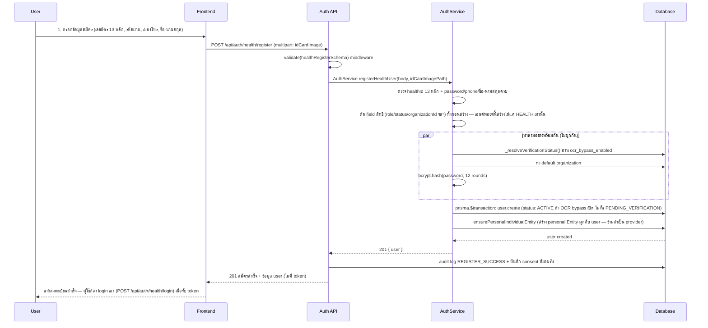

# 🏛️ ระบบสมาชิก (Membership System) - DTAM GACP
## เอกสารอธิบายโครงสร้างและการทำงานของระบบสมาชิก

---

## 📋 สารบัญ

1. [ภาพรวมระบบ](#1-ภาพรวมระบบ)
2. [โครงสร้างข้อมูลผู้ใช้](#2-โครงสร้างข้อมูลผู้ใช้)
3. [ประเภทบัญชีผู้ใช้](#3-ประเภทบัญชีผู้ใช้)
4. [กระบวนการสมัครสมาชิก](#4-กระบวนการสมัครสมาชิก)
5. [ระบบยืนยันตัวตน (Authentication)](#5-ระบบยืนยันตัวตน-authentication)
6. [ระบบสิทธิ์การใช้งาน (Authorization)](#6-ระบบสิทธิ์การใช้งาน-authorization)
7. [ความปลอดภัย](#7-ความปลอดภัย)
8. [API Endpoints](#8-api-endpoints)

---

## 1. ภาพรวมระบบ

```
┌─────────────────────────────────────────────────────────────────────┐
│                    Membership System Architecture                   │
├─────────────────────────────────────────────────────────────────────┤
│                                                                      │
│  ┌──────────────┐    ┌──────────────┐    ┌──────────────┐         │
│  │   Health     │    │    Provider     │    │    Admin     │         │
│  │  (Public)    │    │   (DTAM)     │    │  (Super)     │         │
│  └──────┬───────┘    └──────┬───────┘    └──────┬───────┘         │
│         │                    │                    │                │
│         └────────────────────┼────────────────────┘                │
│                              │                                      │
│                    ┌─────────┴─────────┐                           │
│                    │  Auth Middleware  │                           │
│                    │  (JWT + Session)  │                           │
│                    └─────────┬─────────┘                           │
│                              │                                      │
│         ┌────────────────────┼────────────────────┐                │
│         │                    │                    │                │
│    ┌────┴────┐         ┌────┴────┐         ┌────┴────┐           │
│    │  Login  │         │ Register│         │  2FA    │           │
│    │  OAuth  │         │  Verify │         │ Biometric│          │
│    └─────────┘         └─────────┘         └─────────┘           │
│                                                                      │
└─────────────────────────────────────────────────────────────────────┘
```

---

## 2. โครงสร้างข้อมูลผู้ใช้

### 2.1 Database Schema (Prisma)

```prisma
model User {
  id                String    @id @default(uuid())
  email             String?   @unique
  phone             String    @unique
  firstName         String
  lastName          String
  idCardHash        String?   // Hash of Thai ID Card
  passwordHash      String
  
  // Account Type
  accountType       AccountType @default(INDIVIDUAL)
  role              UserRole    @default(Applicant)
  status            UserStatus  @default(PENDING)
  
  // Profile
  avatarUrl         String?
  address           String?
  province          String?
  district          String?
  subDistrict       String?
  postCode          String?
  
  // Security
  emailVerified     Boolean   @default(false)
  phoneVerified     Boolean   @default(false)
  twoFactorEnabled  Boolean   @default(false)
  twoFactorSecret   String?
  
  // Login Tracking
  lastLoginAt       DateTime?
  loginAttempts     Int       @default(0)
  lockedUntil       DateTime?
  
  // Timestamps
  createdAt         DateTime  @default(now())
  updatedAt         DateTime  @updatedAt
  
  // Relations
  farms             Farm[]
  applications      Application[]
  sessions          UserSession[]
  auditLogs         AuditLog[]
  
  @@index([phone])
  @@index([status])
  @@index([role])
  @@map("users")
}

model UserSession {
  id          String    @id @default(uuid())
  userId      String
  token       String    @unique
  refreshToken String   @unique
  
  // Device Info
  deviceType  String?   // mobile, desktop, tablet
  deviceId    String?
  ipAddress   String?
  userAgent   String?
  
  // Location
  country     String?
  city        String?
  
  // Status
  isValid     Boolean   @default(true)
  expiresAt   DateTime
  createdAt   DateTime  @default(now())
  
  // Relations
  user        User      @relation(fields: [userId], references: [id], onDelete: Cascade)
  
  @@index([userId])
  @@index([token])
  @@map("user_sessions")
}

enum AccountType {
  INDIVIDUAL            // บุคคลธรรมดา
  JURISTIC              // นิติบุคคล
  COMMUNITY_ENTERPRISE  // วิสาหกิจชุมชน
}

enum UserRole {
  Applicant        // เกษตรกร
  provider         // เจ้าหน้าที่ DTAM
  ADMIN         // ผู้ดูแลระบบ
  SUPER_ADMIN   // ซุปเปอร์แอดมิน
}

enum UserStatus {
  PENDING       // รอยืนยัน
  ACTIVE        // ใช้งานได้
  SUSPENDED     // ระงับการใช้งาน
  DEACTIVATED   // ปิดการใช้งาน
}
```

### 2.2 Entity Relationship Diagram

```
┌─────────────────────────────────────────────────────────────────┐
│                         USER                                    │
├─────────────────────────────────────────────────────────────────┤
│ PK  id                  UUID                                    │
│     email               String (unique)                         │
│     phone               String (unique)                         │
│     firstName           String                                  │
│     lastName            String                                  │
│     idCardHash          String                                  │
│     passwordHash        String                                  │
│     accountType         ENUM                                    │
│     role                ENUM                                    │
│     status              ENUM                                    │
│     ...                                                         │
├─────────────────────────────────────────────────────────────────┤
│ 1:N  farms              Farm[]                                  │
│ 1:N  applications       Application[]                           │
│ 1:N  sessions           UserSession[]                           │
└─────────────────────────────────────────────────────────────────┘
                              │
                              │
        ┌─────────────────────┼─────────────────────┐
        │                     │                     │
        ▼                     ▼                     ▼
┌───────────────┐    ┌───────────────┐    ┌───────────────┐
│     FARM      │    │  APPLICATION  │    │ USER_SESSION  │
├───────────────┤    ├───────────────┤    ├───────────────┤
│ PK id         │    │ PK id         │    │ PK id         │
│ FK ownerId    │───▶│ FK applicantId│───▶│ FK userId     │
│     name      │    │     status    │    │     token     │
│     address   │    │     ...       │    │     expiresAt │
└───────────────┘    └───────────────┘    └───────────────┘
```

---

## 3. ประเภทบัญชีผู้ใช้

### 3.1 ตามประเภทบัญชี (AccountType)

```typescript
const ACCOUNT_TYPES = {
  INDIVIDUAL: {
    code: 'INDIVIDUAL',
    label: 'บุคคลธรรมดา',
    requiredDocs: ['ID_CARD'],
    maxFarms: 10,
    canApplyFor: ['HERBAL', 'CANNABIS', 'KRATOM']
  },
  
  JURISTIC: {
    code: 'JURISTIC',
    label: 'นิติบุคคล',
    requiredDocs: ['ID_CARD', 'COMPANY_REG', 'POWER_OF_ATTORNEY'],
    maxFarms: 50,
    canApplyFor: ['HERBAL', 'CANNABIS', 'KRATOM']
  },
  
  COMMUNITY_ENTERPRISE: {
    code: 'COMMUNITY_ENTERPRISE',
    label: 'วิสาหกิจชุมชน',
    requiredDocs: ['ID_CARD', 'COMMUNITY_REG', 'MEETING_MINUTES'],
    maxFarms: 20,
    canApplyFor: ['HERBAL', 'CANNABIS']
  }
};
```

### 3.2 ตามบทบาท (Role)

```typescript
const ROLES = {
  Applicant: {
    level: 1,
    permissions: [
      'farm:create', 'farm:read', 'farm:update', 'farm:delete',
      'application:create', 'application:read', 'application:update',
      'document:upload', 'document:read',
      'profile:read', 'profile:update'
    ],
    menuAccess: ['dashboard', 'farms', 'applications', 'certificates', 'profile']
  },
  
  provider: {
    level: 2,
    permissions: [
      'application:read', 'application:review', 'application:approve',
      'audit:create', 'audit:read', 'audit:update',
      'health:read', 'farm:read',
      'report:read'
    ],
    menuAccess: ['dashboard', 'applications', 'audits', 'Applicants', 'reports']
  },
  
  ADMIN: {
    level: 3,
    permissions: [
      '*:read', '*:create', '*:update',
      'user:manage', 'setting:manage',
      'report:generate', 'analytics:read'
    ],
    menuAccess: ['*'] // All menus
  },
  
  SUPER_ADMIN: {
    level: 4,
    permissions: ['*'], // All permissions
    menuAccess: ['*'],
    specialFeatures: ['system:config', 'database:manage', 'log:access']
  }
};
```

---

## 4. กระบวนการสมัครสมาชิก

### 4.1 Registration Flow



ไม่มีขั้นส่ง OTP ทาง SMS/อีเมล ไม่มีอีเมลต้อนรับ และไม่มี endpoint ยืนยัน OTP หลังสมัคร — สมัครเสร็จคือ
สร้าง user เสร็จ (`status` ตาม OCR-bypass config ไม่ใช่ค่าคงที่ `PENDING`), การยืนยันตัวตนครั้งต่อไปคือ
ล็อกอินตามปกติ ผ่าน 2FA/TOTP เฉพาะบัญชีที่เปิดไว้เท่านั้น (ดู §5.3)
— อ้างอิง `controllers/auth-controller/health-auth-profile-handlers.js` `register()`,
`services/prisma-auth-service.js` `registerHealthUser()` → `register()` → `_resolveVerificationStatus()`,
`services/entity-service.js` `ensurePersonalIndividualEntity()`

### 4.2 Validation Rules

```typescript
const VALIDATION_RULES = {
  thaiId: {
    pattern: /^[1-9]\d{12}$/,
    checksum: true,  // ตรวจสอบเลขตามสูตร
    unique: true     // ต้องไม่ซ้ำในระบบ
  },
  
  phone: {
    pattern: /^0[689]\d{8}$/,
    format: 'thai-mobile',
    unique: true
  },
  
  email: {
    pattern: /^[^\s@]+@[^\s@]+\.[^\s@]+$/,
    unique: true,
    optional: true  // ไม่บังคับ
  },
  
  password: {
    minLength: 8,
    requireUppercase: true,
    requireLowercase: true,
    requireNumber: true,
    requireSpecial: true,
    strength: 'strong'
  }
};
```

---

## 5. ระบบยืนยันตัวตน (Authentication)

### 5.1 JWT Token Structure

```typescript
interface JWTPayload {
  // Standard Claims
  sub: string;        // User ID
  iat: number;        // Issued at
  exp: number;        // Expiration
  jti: string;        // Token ID
  
  // Custom Claims
  role: UserRole;     // User role
  type: 'access' | 'refresh';
  
  // Context
  deviceId?: string;
  sessionId?: string;
}

// Access Token: 15 minutes
// Refresh Token: 7 days
```

### 5.2 Authentication Flow

```
┌─────────────────────────────────────────────────────────────────┐
│                    Authentication Flow                          │
├─────────────────────────────────────────────────────────────────┤
│                                                                  │
│  ┌─────────┐     ┌─────────┐     ┌─────────┐     ┌─────────┐   │
│  │  Login  │────▶│ Validate│────▶│ Generate│────▶│ Return  │   │
│  │ Request │     │ Password│     │ Tokens  │     │ Tokens  │   │
│  └─────────┘     └─────────┘     └─────────┘     └─────────┘   │
│       │                                               │         │
│       │                                               │         │
│       ▼                                               ▼         │
│  ┌─────────┐                                     ┌─────────┐   │
│  │ 2FA?    │────────Yes────────▶│ MFA Challenge│   │
│  │Required?│                                     │ Verify TOTP│  │
│  └─────────┘                                     └─────────┘   │
│       │                                               │         │
│       No                                              │         │
│       │                                               ▼         │
│       └────────────────────────────────────────▶│ Access    │   │
│                                                 │ Granted   │   │
│                                                 └─────────┘   │
│                                                                  │
└─────────────────────────────────────────────────────────────────┘
```

### 5.3 Two-Factor Authentication (2FA)

```typescript
interface TwoFactorConfig {
  methods: {
    TOTP: {
      enabled: true,  // the only second factor — every other method is refused with
                       // MFA_METHOD_RETIRED (routes/api/identity/mfa.js, `if (method !== 'TOTP')`;
                       // apps/backend/shared/second-factor.js hasUsableSecondFactor();
                       // auth.prisma twoFactorMethod default "TOTP")
      issuer: 'DTAM GACP',
      algorithm: 'SHA256'
    },
    BIOMETRIC: {
      enabled: false,  // Future feature
      methods: ['fingerprint', 'face']
    }
  }
}
```

---

## 6. ระบบสิทธิ์การใช้งาน (Authorization)

### 6.1 RBAC (Role-Based Access Control)

```typescript
// Permission Check Middleware
const checkPermission = (requiredPermission: string) => {
  return (req: Request, res: Response, next: NextFunction) => {
    const user = req.user;
    const userRole = ROLES[user.role];
    
    // Check if user has wildcard permission
    if (userRole.permissions.includes('*')) {
      return next();
    }
    
    // Check specific permission
    if (userRole.permissions.includes(requiredPermission)) {
      return next();
    }
    
    // Check resource-level permission
    const [resource, action] = requiredPermission.split(':');
    if (userRole.permissions.includes(`${resource}:*`)) {
      return next();
    }
    
    return res.status(403).json({
      error: 'Forbidden',
      message: 'คุณไม่มีสิทธิ์เข้าถึงฟีเจอร์นี้'
    });
  };
};

// Usage
router.post('/applications', 
  authenticateJWT,
  checkPermission('application:create'),
  applicationController.create
);
```

### 6.2 Permission Matrix

```
┌────────────────────┬─────────┬─────────┬─────────┬─────────────┐
│ Feature            │ Health  │ Provider   │ Admin   │ Super Admin │
├────────────────────┼─────────┼─────────┼─────────┼─────────────┤
│ Profile Management │  ✓✓✓✓   │  ✓✓     │  ✓✓✓   │    ✓✓✓✓     │
│ Farm Management    │  ✓✓✓✓   │  ✓✓     │  ✓✓✓   │    ✓✓✓✓     │
│ Application Create │  ✓✓     │  ✗✗     │  ✓✓    │    ✓✓       │
│ Application Review │  ✗✗     │  ✓✓✓✓   │  ✓✓✓   │    ✓✓✓✓     │
│ Audit Management   │  ✗✗     │  ✓✓✓✓   │  ✓✓✓   │    ✓✓✓✓     │
│ Certificate Issue  │  ✗✗     │  ✓✓     │  ✓✓✓✓  │    ✓✓✓✓     │
│ User Management    │  ✗✗     │  ✗✗     │  ✓✓✓   │    ✓✓✓✓     │
│ System Settings    │  ✗✗     │  ✗✗     │  ✗✗    │    ✓✓✓✓     │
│ Analytics/Reports  │  ✓      │  ✓✓✓    │  ✓✓✓✓  │    ✓✓✓✓     │
└────────────────────┴─────────┴─────────┴─────────┴─────────────┘

✓✓✓✓ = Full access
✓✓✓  = Read + Create + Update
✓✓   = Read + Create
✓    = Read only
✗✗   = No access
```

---

## 7. ความปลอดภัย

### 7.1 Security Measures

```typescript
const SECURITY_CONFIG = {
  // Password Policy
  password: {
    minLength: 8,
    maxAge: 90,  // เปลี่ยนรหัสทุก 90 วัน
    history: 5,  // ห้ามใช้รหัสซ้ำ 5 ครั้งล่าสุด
    bcryptRounds: 12
  },
  
  // Login Protection
  login: {
    maxAttempts: 5,
    lockoutDuration: 30,  // นาที
    notifyOnLockout: true
  },
  
  // Session Management
  session: {
    accessTokenExpiry: '15m',
    refreshTokenExpiry: '7d',
    maxConcurrentSessions: 3,
    invalidateOnPasswordChange: true
  },
  
  // Rate Limiting
  rateLimit: {
    login: { window: '15m', max: 10 },
    register: { window: '1h', max: 5 },
    api: { window: '1m', max: 100 }
  }
};
```

### 7.2 Audit Logging

```typescript
interface AuditLog {
  id: string;
  userId: string;
  action: string;       // LOGIN, LOGOUT, PASSWORD_CHANGE, etc.
  resource: string;     // farm, application, user
  resourceId?: string;
  oldValue?: any;
  newValue?: any;
  ipAddress: string;
  userAgent: string;
  timestamp: Date;
  riskScore?: number;   // สำหรับ fraud detection
}
```

---

## 8. API Endpoints

### 8.1 Authentication Endpoints

```yaml
# Auth API
paths:
  /api/auth/register:
    post:
      summary: ลงทะเบียนผู้ใช้ใหม่
      requestBody:
        content:
          application/json:
            schema:
              type: object
              required: [phone, password, firstName, lastName, idCard]
              properties:
                phone: { type: string, example: "0812345678" }
                password: { type: string, example: "SecurePass123!" }
                firstName: { type: string, example: "สมชาย" }
                lastName: { type: string, example: "ใจดี" }
                idCard: { type: string, example: "1234567890123" }
                email: { type: string, example: "somchai@test.com" }
                accountType: { type: string, enum: [INDIVIDUAL, JURISTIC, COMMUNITY_ENTERPRISE] }
      responses:
        201: { description: สมัครสำเร็จ }
        409: { description: ผู้ใช้มีอยู่แล้ว }

  /api/auth/login:
    post:
      summary: เข้าสู่ระบบ
      requestBody:
        content:
          application/json:
            schema:
              type: object
              required: [identifier, password]
              properties:
                identifier: { type: string, description: "เบอร์โทรหรืออีเมล" }
                password: { type: string }
                deviceId: { type: string }
      responses:
        200: 
          description: เข้าสู่ระบบสำเร็จ
          content:
            application/json:
              schema:
                type: object
                properties:
                  accessToken: { type: string }
                  refreshToken: { type: string }
                  user: { $ref: '#/components/schemas/User' }
        401: { description: รหัสผ่านไม่ถูกต้อง }
        423: { description: บัญชีถูกล็อค }

  /api/mfa/verify:
    post:
      summary: ยืนยัน 2FA ตอน login — ปัจจัยที่สองคือ TOTP เท่านั้น (`routes/api/identity/mfa.js`, `router.post('/verify', ...)`)
      requestBody:
        content:
          application/json:
            schema:
              type: object
              required: [mfa_session, code]
              properties:
                mfa_session: { type: string, description: "signed MFA challenge token จากขั้น login" }
                code: { type: string, example: "123456", description: "TOTP 6 หลักจากแอป authenticator" }
                isBackupCode: { type: boolean }

  /api/auth/refresh:
    post:
      summary: ต่ออายุ Access Token
      requestBody:
        content:
          application/json:
            schema:
              type: object
              required: [refreshToken]
              properties:
                refreshToken: { type: string }

  /api/auth/logout:
    post:
      summary: ออกจากระบบ
      security:
        - bearerAuth: []
      responses:
        200: { description: ออกจากระบบสำเร็จ }

  # ⛔ ไม่มีการรีเซ็ตรหัสผ่านไม่ว่ารูปแบบใด จึงไม่มี path ขอรีเซ็ตหรือรีเซ็ตรหัสผ่านในสัญญานี้
  # - 2026-09-16: ไม่มีระบบลืมรหัสผ่านทางอีเมลหรือ SMS (forgot-password ถูกถอด)
  # - 2026-09-17: มติ operator "เราไม่มีการกู้บัญชี" — token ที่เจ้าหน้าที่ออกให้
  #   (POST /api/provider/directory/{id}/force-password-reset → POST /api/auth/health/reset-password/{token})
  #   ถูกถอดทั้งสองปลาย

  /api/auth/me:
    get:
      summary: ดูข้อมูลผู้ใช้ปัจจุบัน
      security:
        - bearerAuth: []
      responses:
        200:
          content:
            application/json:
              schema:
                $ref: '#/components/schemas/User'

  /api/auth/change-password:
    put:
      summary: เปลี่ยนรหัสผ่าน
      security:
        - bearerAuth: []
      requestBody:
        content:
          application/json:
            schema:
              type: object
              required: [oldPassword, newPassword]
              properties:
                oldPassword: { type: string }
                newPassword: { type: string }

  # เจ้าหน้าที่เปลี่ยนรหัสผ่านของตัวเอง (มติ operator 2026-09-26) — รหัสเดิม + รหัสใหม่ เกณฑ์และผลเหมือนประตูผู้ขอรับรอง
  # (POST /api/auth/health/change-password) · ไดเรกทอรีเจ้าหน้าที่ (PUT/PATCH /api/provider/directory/{id})
  # ไม่รับ password อีก: 400 DIRECTORY_PASSWORD_WRITE_FORBIDDEN
  /api/auth/provider/change-password:
    post:
      summary: เจ้าหน้าที่เปลี่ยนรหัสผ่านของตัวเอง
      security:
        - bearerAuth: []
      requestBody:
        content:
          application/json:
            schema:
              type: object
              required: [oldPassword, newPassword]
              properties:
                oldPassword: { type: string }
                newPassword: { type: string }

  /api/auth/sessions:
    get:
      summary: ดูเซสชันที่ใช้งานอยู่
      security:
        - bearerAuth: []
    
    delete:
      summary: ยกเลิกเซสชันอื่นๆ
      security:
        - bearerAuth: []
```

---

## 📊 สรุป

### สถาปัตยกรรมหลัก:
1. **Multi-role System** - รองรับเกษตรกร, เจ้าหน้าที่, แอดมิน
2. **JWT Authentication** - Stateless authentication พร้อม refresh token
3. **2FA Support** - TOTP (Google Authenticator) เป็นปัจจัยที่สองตัวเดียว — วิธีอื่นถูกปฏิเสธด้วย `MFA_METHOD_RETIRED`
4. **RBAC** - ระบบสิทธิ์แบบละเอียด
5. **Audit Logging** - บันทึกทุกการกระทำ
6. **Security First** - Rate limiting, password policy, session management

### ความปลอดภัย:
- ✅ bcrypt 12 rounds สำหรับ hash รหัสผ่าน
- ✅ Thai ID Checksum validation
- ✅ JWT with short expiry + refresh tokens
- ✅ Rate limiting ทุก endpoint
- ✅ Account lockout ป้องกัน brute force
- ✅ Audit log ทุก action

---

**เอกสารนี้ครอบคลุมระบบสมาชิกทั้งหมดของ DTAM GACP** 📚
