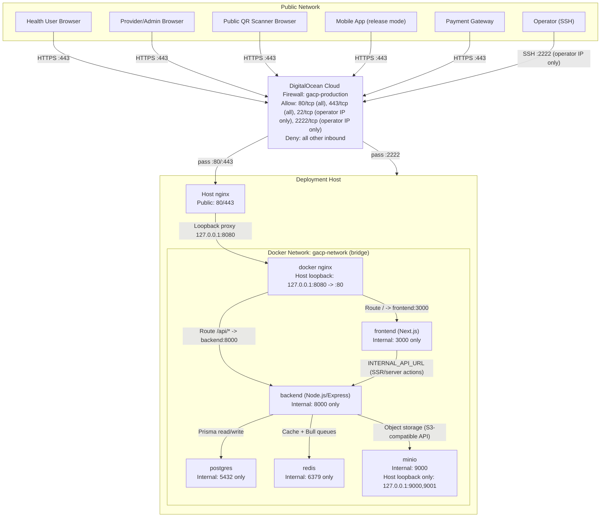

# GACP Runtime Network Diagram (Required Topology)

Last updated: 2026-03-08

Source of truth:
- `docker-compose.production.yml`
- `nginx/gacp.production.conf`
- `apps/backend/server.js`
- `apps/backend/routes/api/webhooks.js`

## 1) Production network diagram (the one we must use)

## 2) Required network rules

- All inbound traffic passes through DigitalOcean Cloud Firewall (`gacp-production`) first.
- Cloud Firewall allows: port 80/tcp (all), port 443/tcp (all), port 22/tcp (operator IP only), port 2222/tcp (operator IP only). All other inbound is denied.
- SSH access uses port 2222 from outside. Port 22 is restricted to operator IP at cloud firewall level.
- Public ingress must go through host `nginx` only (`80/443`).
- Docker `nginx` must bind to loopback only (`127.0.0.1:8080:80`) on single-host production.
- `frontend:3000` and `backend:8000` must stay internal-only.
- `postgres:5432` and `redis:6379` must stay internal-only.
- `minio` console and API are host-loopback bound only (`127.0.0.1`), not public.
- Payment callbacks come through `POST /api/webhooks/payment` via nginx.
