# คู่มือการใช้งานระบบรับรองมาตรฐาน GACP

**สำหรับเกษตรกรผู้ขอรับรอง และเจ้าหน้าที่ผู้ปฏิบัติงาน**
กรมการแพทย์แผนไทยและการแพทย์ทางเลือก กระทรวงสาธารณสุข
ฉบับที่ 2 เดือนสิงหาคม 2569

> ภาพประกอบทั้งหมดถ่ายจากระบบรุ่นทดสอบ ข้อมูลที่ปรากฏเป็นข้อมูลตัวอย่าง ไม่ใช่ข้อมูลจริง
>
> ไฟล์เอกสารฉบับแจกจ่าย: `USER-MANUAL-GACP.docx` (สร้างจากเนื้อหาเดียวกับไฟล์นี้)

## สารบัญ

- [บทที่ 1 การเริ่มต้นใช้งาน](#บทที่-1--การเริ่มต้นใช้งาน)
- [บทที่ 2 สำหรับเกษตรกร: การขอรับรอง GACP](#บทที่-2--สำหรับเกษตรกร-การขอรับรอง-gacp)
- [บทที่ 3 ระบบฟาร์ม ทีมงาน และแปลงปลูก](#บทที่-3--ระบบฟาร์ม-ทีมงาน-และแปลงปลูก)
- [บทที่ 4 ระบบการปลูก](#บทที่-4--ระบบการปลูก)
- [บทที่ 5 ฐานข้อมูลสมุนไพร](#บทที่-5--ฐานข้อมูลสมุนไพร)
- [บทที่ 6 รหัสคิวอาร์และการตามสอบย้อนกลับ](#บทที่-6--รหัสคิวอาร์และการตามสอบย้อนกลับ-จากเมล็ดถึงมือผู้ซื้อ)
- [บทที่ 7 ระบบแบบสำรวจ](#บทที่-7--ระบบแบบสำรวจ)
- [บทที่ 8 สำหรับเจ้าหน้าที่ผู้ตรวจเอกสาร](#บทที่-8--สำหรับเจ้าหน้าที่ผู้ตรวจเอกสาร)
- [บทที่ 9 สำหรับเจ้าหน้าที่ผู้ประสานงานนัดตรวจ](#บทที่-9--สำหรับเจ้าหน้าที่ผู้ประสานงานนัดตรวจ)
- [บทที่ 10 สำหรับเจ้าหน้าที่ผู้ตรวจประเมินภาคสนาม](#บทที่-10--สำหรับเจ้าหน้าที่ผู้ตรวจประเมินภาคสนาม)
- [บทที่ 11 สำหรับเจ้าหน้าที่การเงิน](#บทที่-11--สำหรับเจ้าหน้าที่การเงิน)
- [บทที่ 12 สำหรับผู้ดูแลระบบ](#บทที่-12--สำหรับผู้ดูแลระบบ)
- [ภาคผนวก ก การตรวจสอบใบรับรองสำหรับบุคคลทั่วไป](#ภาคผนวก-ก--การตรวจสอบใบรับรองสำหรับบุคคลทั่วไป)
- [ภาคผนวก ข ฟีเจอร์ที่จะเปิดใช้เร็ว ๆ นี้ และส่วนที่อยู่ระหว่างพัฒนา](#ภาคผนวก-ข--ฟีเจอร์ที่จะเปิดใช้เร็ว-ๆ-นี้-และส่วนที่อยู่ระหว่างพัฒนา)

**วิธีใช้คู่มือเล่มนี้** — คู่มือนี้เรียงตามขั้นตอนการใช้งานจริง อ่านเฉพาะบทที่ตรงกับหน้าที่ของคุณได้เลย เกษตรกรอ่านบทที่ 1 ถึง 7 เจ้าหน้าที่อ่านบทที่ 1 และบทของหน้าที่ตนเอง ใต้ภาพแต่ละภาพมีขั้นตอนบอกว่าดูอะไรและกดอะไร ทีละข้อ

---

## บทที่ 1  การเริ่มต้นใช้งาน

### 1.1 เข้าเว็บไซต์และหน้าเข้าสู่ระบบ

เมื่อเปิดเว็บไซต์ระบบรับรองมาตรฐาน GACP หน้าแรกที่พบคือหน้าเข้าสู่ระบบสำหรับประชาชนและเกษตรกร

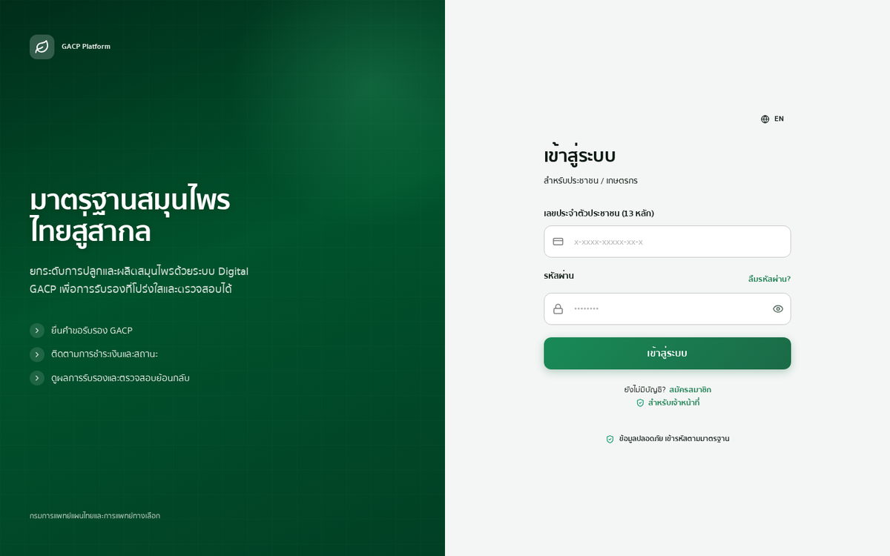
*ภาพที่ 1: หน้าเข้าสู่ระบบสำหรับประชาชนและเกษตรกร (จอคอมพิวเตอร์)*

1. กรอกเลขประจำตัวประชาชน 13 หลัก ในช่องแรก
2. กรอกรหัสผ่านที่ตั้งไว้ตอนสมัคร แตะรูปดวงตาเพื่อดูรหัสที่พิมพ์ได้
3. กดปุ่ม เข้าสู่ระบบ หากยังไม่มีบัญชี กดลิงก์ สมัครสมาชิก ใต้ปุ่ม

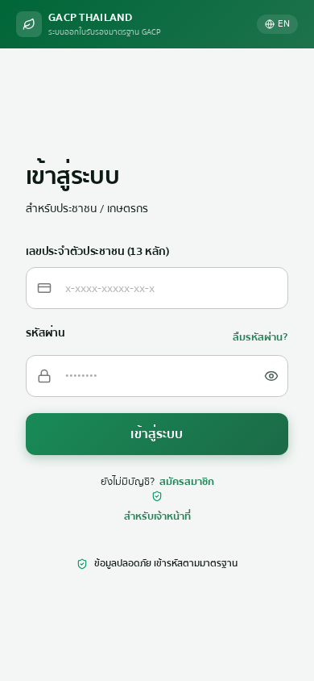
*ภาพที่ 2: หน้าเข้าสู่ระบบเมื่อเปิดจากโทรศัพท์มือถือ ใช้งานได้เหมือนกันทุกขั้นตอน*

> **หมายเหตุ: ฟีเจอร์นี้จะเปิดใช้เร็ว ๆ นี้**
> การเข้าสู่ระบบด้วยบัตรประชาชนผ่านแอป ThaID และการเชื่อมบัญชีกับหน่วยงานกลาง ยังไม่เปิดให้ใช้งาน
> วันนี้ใช้บัญชีที่สมัครกับระบบนี้โดยตรงเท่านั้น เมื่อเปิดใช้แล้วจะมีปุ่มเพิ่มในหน้าเข้าสู่ระบบ

### 1.2 สมัครสมาชิก (สำหรับเกษตรกร)

การสมัครมี 4 ขั้นตอน ได้แก่ ข้อมูลส่วนตัว ช่องทางติดต่อ ตั้งรหัสผ่าน และยืนยัน ระบบจะแสดงว่าอยู่ขั้นตอนใดที่แถบด้านซ้ายของจอ

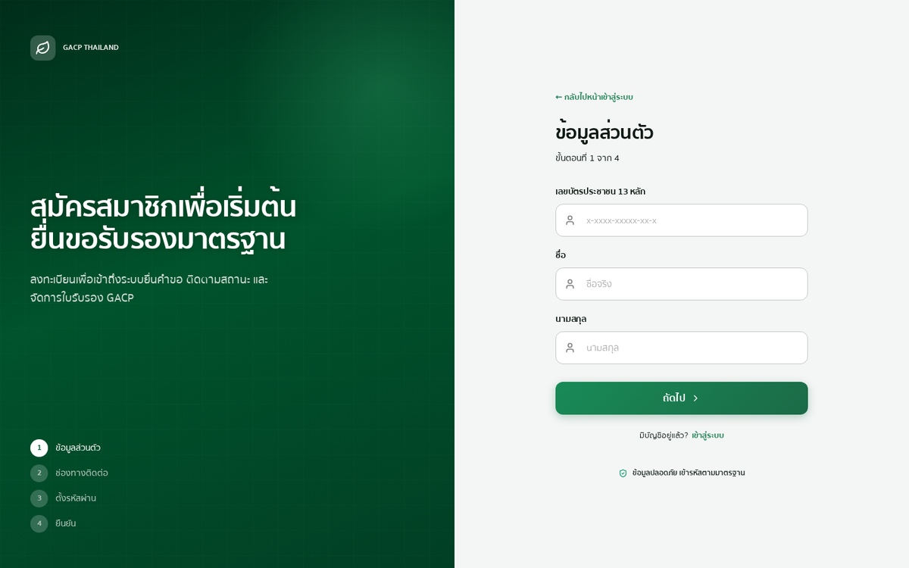
*ภาพที่ 3: หน้าสมัครสมาชิก ขั้นตอนที่ 1 จาก 4 (ข้อมูลส่วนตัว)*

1. กรอกเลขบัตรประชาชน 13 หลัก ชื่อจริง และนามสกุล
2. กดปุ่ม ถัดไป แล้วกรอกช่องทางติดต่อ ตั้งรหัสผ่าน และยืนยันข้อมูลตามลำดับ
3. เมื่อสมัครสำเร็จ ระบบจะพากลับไปหน้าเข้าสู่ระบบ ใช้เลขบัตรและรหัสผ่านที่ตั้งไว้เข้าสู่ระบบได้ทันที

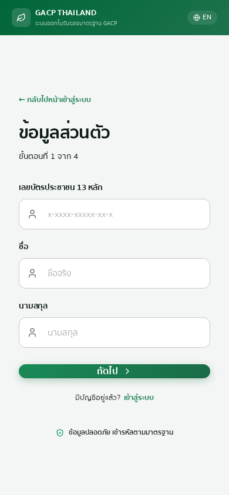
*ภาพที่ 4: หน้าสมัครสมาชิกบนโทรศัพท์มือถือ*

### 1.3 เข้าสู่ระบบไม่ได้

ระบบนี้ไม่มีการกู้บัญชี หากลืมรหัสผ่าน จะตั้งรหัสผ่านใหม่ไม่ได้ ระบบไม่มีการรีเซ็ตรหัสผ่านด้วยตนเอง ไม่มีขั้นตอนให้เจ้าหน้าที่ตั้งรหัสผ่านใหม่ให้ และไม่ส่งรหัสหรือลิงก์ใดทางอีเมลหรือข้อความโทรศัพท์ กรุณาเก็บรหัสผ่านที่ตั้งไว้ตอนสมัครให้ดี

- กรอกรหัสผ่านผิด 5 ครั้งติดกัน ระบบจะล็อกบัญชีไว้ 15 นาที รอให้ครบเวลาแล้วลองใหม่ได้
- ระบบแจ้งว่าบัญชีถูกระงับการใช้งาน หากมีข้อสงสัยให้ติดต่อเจ้าหน้าที่ DTAM การติดต่อนี้เป็นการสอบถามเรื่องการระงับ ไม่ใช่การกู้บัญชี

### 1.4 เข้าสู่ระบบสำหรับเจ้าหน้าที่

เจ้าหน้าที่ทุกตำแหน่งใช้หน้าเข้าสู่ระบบแยกจากประชาชน โดยกดลิงก์ สำหรับเจ้าหน้าที่ ในหน้าเข้าสู่ระบบปกติ

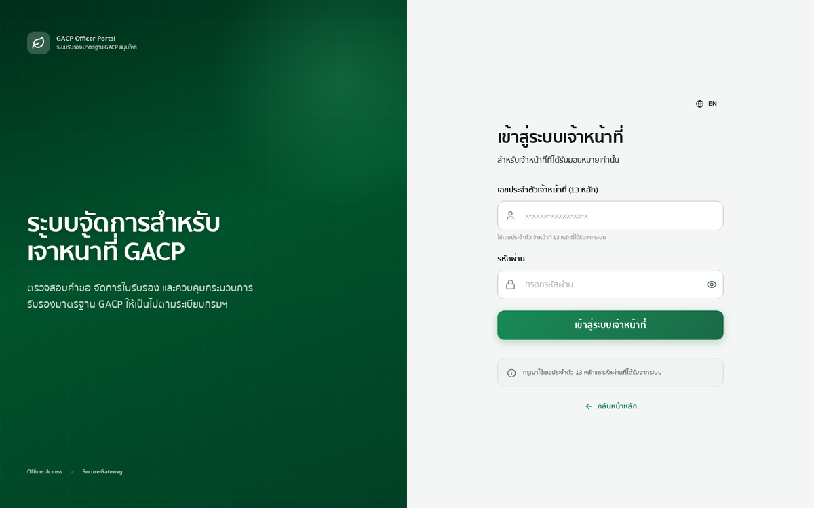
*ภาพที่ 5: หน้าเข้าสู่ระบบเจ้าหน้าที่ ใช้เลขประจำตัวเจ้าหน้าที่ 13 หลักที่ได้รับจากระบบ*

1. กรอกเลขประจำตัวเจ้าหน้าที่ 13 หลัก และรหัสผ่านที่ได้รับจากผู้ดูแลระบบ
2. กดปุ่ม เข้าสู่ระบบเจ้าหน้าที่
3. ระบบจะพาไปยังหน้าหลักตามหน้าที่ของแต่ละคนโดยอัตโนมัติ

เจ้าหน้าที่เปลี่ยนรหัสผ่านของตนเองได้ที่เมนูโปรไฟล์ หัวข้อความปลอดภัยบัญชี (หน้า /provider/profile/security) โดยกรอกรหัสผ่านปัจจุบันและรหัสผ่านใหม่ ควรเปลี่ยนรหัสผ่านที่ได้รับจากผู้ดูแลระบบตั้งแต่เข้าสู่ระบบครั้งแรก เปลี่ยนแล้วทุกอุปกรณ์จะออกจากระบบ ให้เข้าสู่ระบบใหม่ด้วยรหัสผ่านใหม่ หากกรอกรหัสผ่านปัจจุบันผิด 5 ครั้งติดกัน บัญชีจะถูกล็อก 15 นาทีเช่นเดียวกับตอนเข้าสู่ระบบ ผู้ดูแลระบบตั้งรหัสผ่านให้บัญชีที่มีอยู่แล้วไม่ได้ และระบบไม่มีการกู้บัญชี หากลืมรหัสผ่านจะตั้งใหม่ไม่ได้เช่นเดียวกับผู้ขอรับรอง ผู้ดูแลระบบปิดหรือรีเซ็ตการยืนยันตัวตนสองขั้นตอน (2FA) ของผู้อื่นไม่ได้ เจ้าของบัญชีปิดได้เองด้วยรหัสจากแอปยืนยันตัวตนของตนเท่านั้น

### 1.5 ศูนย์ช่วยเหลือและคำถามที่พบบ่อย

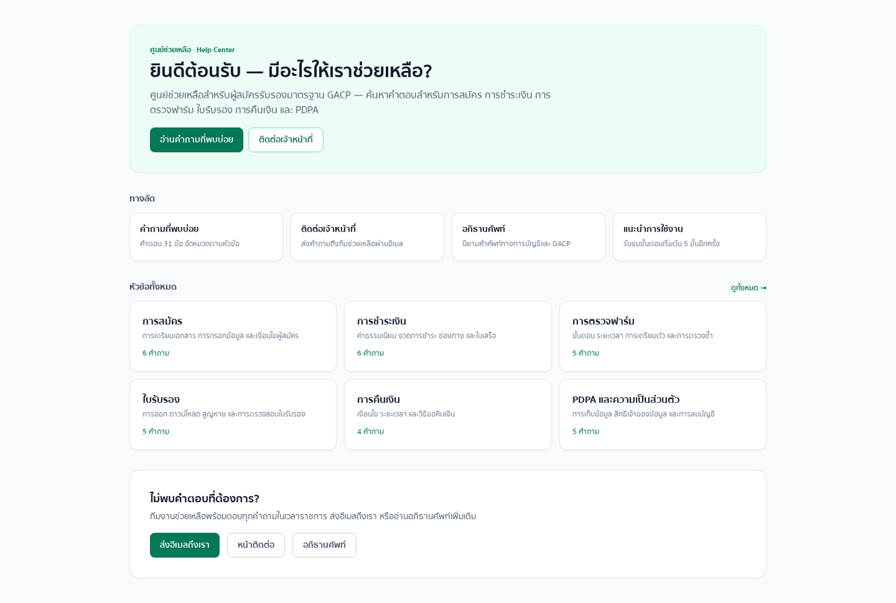
*ภาพที่ 6: ศูนย์ช่วยเหลือ รวมคำถามที่พบบ่อย ช่องทางติดต่อเจ้าหน้าที่ และอภิธานศัพท์*

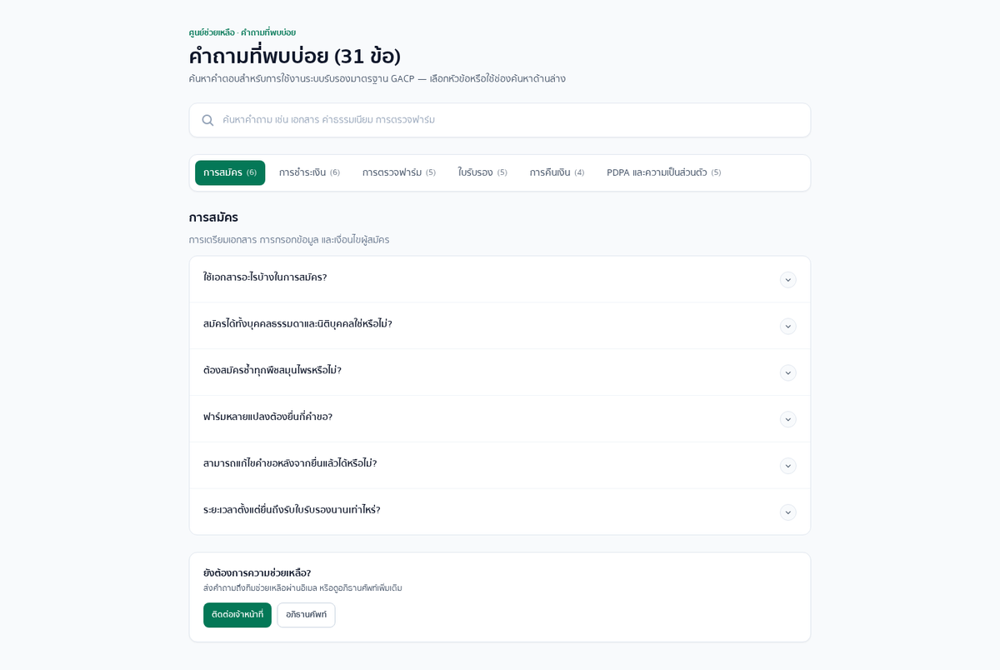
*ภาพที่ 7: หน้าคำถามที่พบบ่อย แยกหมวดการสมัคร การชำระเงิน การตรวจฟาร์ม ใบรับรอง การคืนเงิน และความเป็นส่วนตัว*

1. เข้าเมนู ช่วยเหลือ ได้จากแถบเมนูด้านบนของทุกหน้า
2. เลือกหมวดคำถาม หรือพิมพ์คำที่ต้องการในช่องค้นหา
3. หากไม่พบคำตอบ กดปุ่ม ติดต่อเจ้าหน้าที่ เพื่อส่งคำถามทางอีเมล

---

## บทที่ 2  สำหรับเกษตรกร: การขอรับรอง GACP

บทนี้เรียงตามเส้นทางการขอรับรองจริงตั้งแต่ยื่นคำขอจนได้รับใบรับรอง เกษตรกรส่วนใหญ่ใช้โทรศัพท์มือถือ จึงแสดงภาพจอโทรศัพท์คู่กับจอคอมพิวเตอร์ในขั้นตอนสำคัญ ส่วนระบบสนับสนุนอื่น ๆ เช่น ฟาร์ม การปลูก และการตามสอบย้อนกลับ อยู่ในบทที่ 3 ถึง 7

### 2.1 ภาพรวมขั้นตอนทั้งหมด

| ขั้นตอน | ใครเป็นผู้ดำเนินการ |
|---|---|
| 1. สมัครสมาชิกและเข้าสู่ระบบ | เกษตรกร |
| 2. ยื่นคำขอรับรอง | เกษตรกร |
| 3. ชำระค่าตรวจเอกสาร (งวดที่ 1) | เกษตรกร |
| 4. ตรวจเอกสาร | เจ้าหน้าที่ (เกษตรกรรอผล) |
| 5. แก้ไขเอกสารตามคำแนะนำ (ถ้ามี) | เกษตรกร |
| 6. ชำระค่าตรวจประเมินภาคสนาม (งวดที่ 2) | เกษตรกร |
| 7. นัดหมายและตรวจประเมินที่ฟาร์ม | เจ้าหน้าที่ (เกษตรกรรอนัด) |
| 8. รับใบรับรองพร้อมรหัสคิวอาร์ (QR) | ระบบออกให้อัตโนมัติ |

### 2.2 แดชบอร์ด หน้าหลักหลังเข้าสู่ระบบ

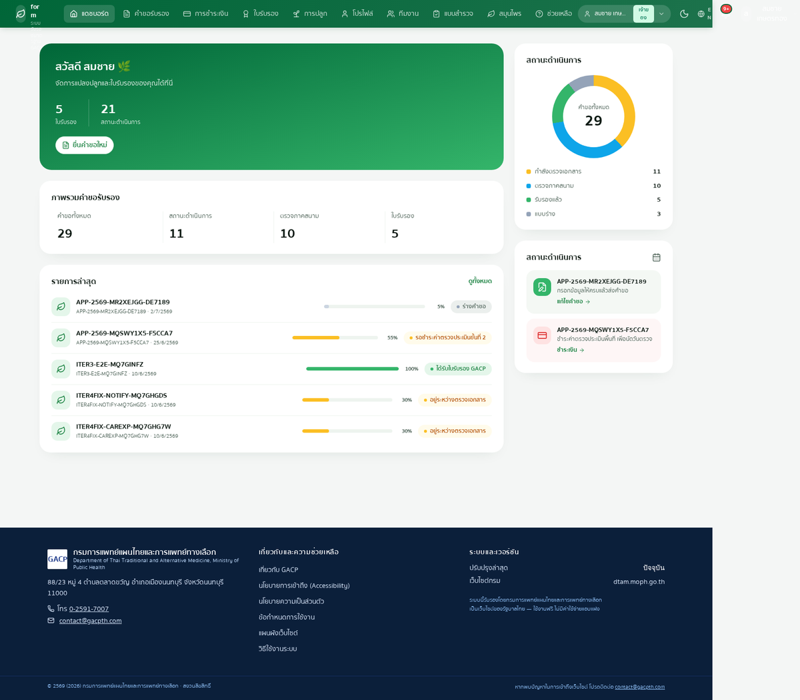
*ภาพที่ 8: แดชบอร์ดของเกษตรกร สรุปจำนวนคำขอ สถานะดำเนินการ และรายการล่าสุด*

1. ดูการ์ดสีเขียวด้านบน สรุปจำนวนใบรับรองและงานที่กำลังดำเนินการของคุณ
2. ดูกล่อง รายการล่าสุด แต่ละคำขอมีแถบความคืบหน้าและป้ายบอกสถานะ เช่น อยู่ระหว่างตรวจเอกสาร
3. กล่อง สถานะดำเนินการ ด้านขวาบอกงานที่ต้องทำต่อ เช่น ชำระเงิน หรือ แก้ไขคำขอ กดที่รายการเพื่อไปทำได้ทันที
4. กดปุ่ม ยื่นคำขอใหม่ เมื่อต้องการเริ่มขอรับรองแปลงใหม่

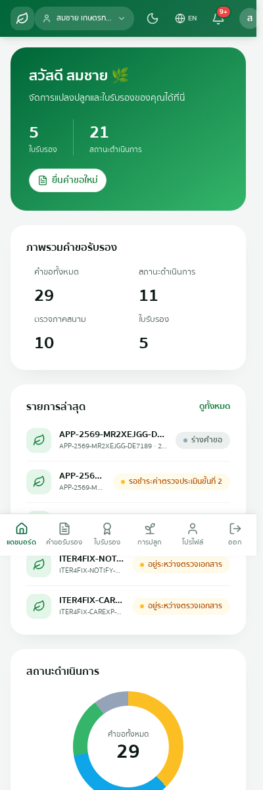
*ภาพที่ 9: แดชบอร์ดบนโทรศัพท์มือถือ เลื่อนลงเพื่อดูข้อมูลครบทุกส่วน*

### 2.3 ค่าธรรมเนียมการรับรอง

ก่อนยื่นคำขอ คุณดูอัตราค่าธรรมเนียมทั้งหมดได้จากหน้า ค่าธรรมเนียม ซึ่งเปิดดูได้โดยไม่ต้องเข้าสู่ระบบ ค่าธรรมเนียมแบ่งเป็น 2 งวด คือ งวดที่ 1 ค่าตรวจเอกสาร ชำระหลังยื่นคำขอ และงวดที่ 2 ค่าตรวจประเมินภาคสนาม ชำระก่อนวันนัดตรวจ ยอดจริงของแต่ละงวดแสดงในหน้านี้และในหน้าการชำระเงินของคุณ

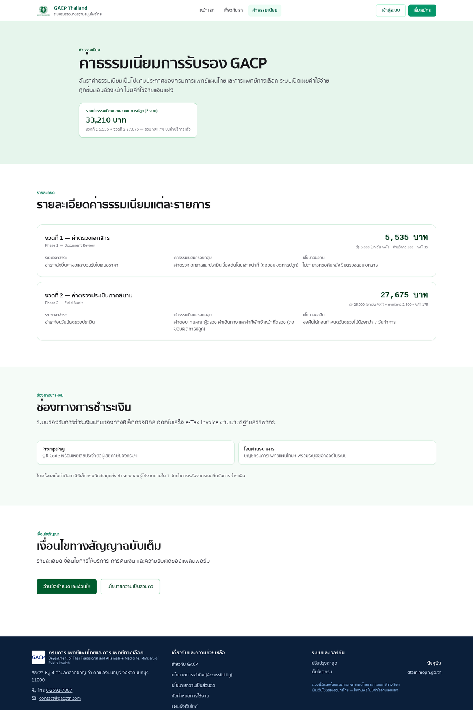
*ภาพที่ 10: หน้าค่าธรรมเนียม แสดงยอดแต่ละงวด เงื่อนไขการคืนเงิน และช่องทางการชำระ*

### 2.4 ตรวจสอบความพร้อมก่อนยื่นคำขอ

*ภาพที่ 11: หน้าตรวจสอบความพร้อม ไล่รายการ 6 ข้อที่ควรมีก่อนยื่นคำขอ พร้อมลิงก์พาไปทำแต่ละข้อ*

1. เข้าเมนู เริ่มต้น แล้วเลือก ตรวจสอบความพร้อม ระบบจะไล่ตรวจ 6 รายการ เช่น ข้อมูลโปรไฟล์ สถานประกอบการ ฟาร์มและแปลงปลูก เอกสารมาตรฐานการปฏิบัติงาน เอกสารประกอบ และผลตรวจคุณภาพน้ำ
2. ข้อที่มีเครื่องหมายถูกสีเขียวคือพร้อมแล้ว ข้อที่ยังไม่พร้อมจะมีลิงก์พาไปทำต่อได้ทันที
3. จะกดปุ่ม ยื่นคำขอเลย โดยข้ามรายการที่ยังไม่พร้อมก็ได้ แต่เตรียมให้ครบก่อนจะช่วยให้การตรวจเอกสารผ่านเร็วขึ้น

### 2.5 แบบฟอร์มมาตรฐานการปฏิบัติงาน (SOP)

เอกสารมาตรฐานการปฏิบัติงาน หรือ SOP คือเอกสารอธิบายวิธีทำงานในฟาร์มของคุณ เช่น การเพาะปลูก การเก็บเกี่ยว การตากแห้ง ระบบมีแบบฟอร์มสำเร็จรูปให้ดาวน์โหลด 7 ชุด ชุดที่มีป้าย บังคับ ต้องแนบทุกฉบับตอนยื่นคำขอ

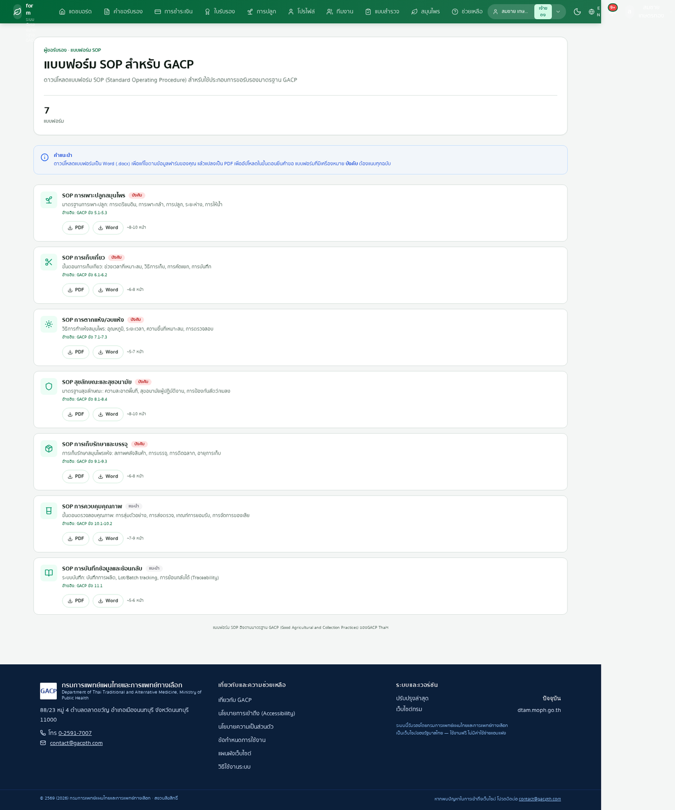
*ภาพที่ 12: หน้าแบบฟอร์มมาตรฐานการปฏิบัติงาน ดาวน์โหลดได้ทั้งแบบเอกสารแก้ไขได้และแบบพร้อมพิมพ์*

1. เข้าเมนู แบบสำรวจ หรือหน้าตรวจสอบความพร้อม แล้วเลือก ดาวน์โหลดแบบฟอร์ม จะพบแบบฟอร์มทั้ง 7 ชุด
2. กดปุ่มดาวน์โหลดแบบเอกสารแก้ไขได้ เพื่อกรอกข้อมูลฟาร์มของคุณ แล้วบันทึกเป็นไฟล์พร้อมพิมพ์
3. นำไฟล์ที่กรอกแล้วไปแนบในขั้นตอน หลักฐานประกอบคำขอ ตอนยื่นคำขอรับรอง

### 2.6 ยื่นคำขอรับรอง

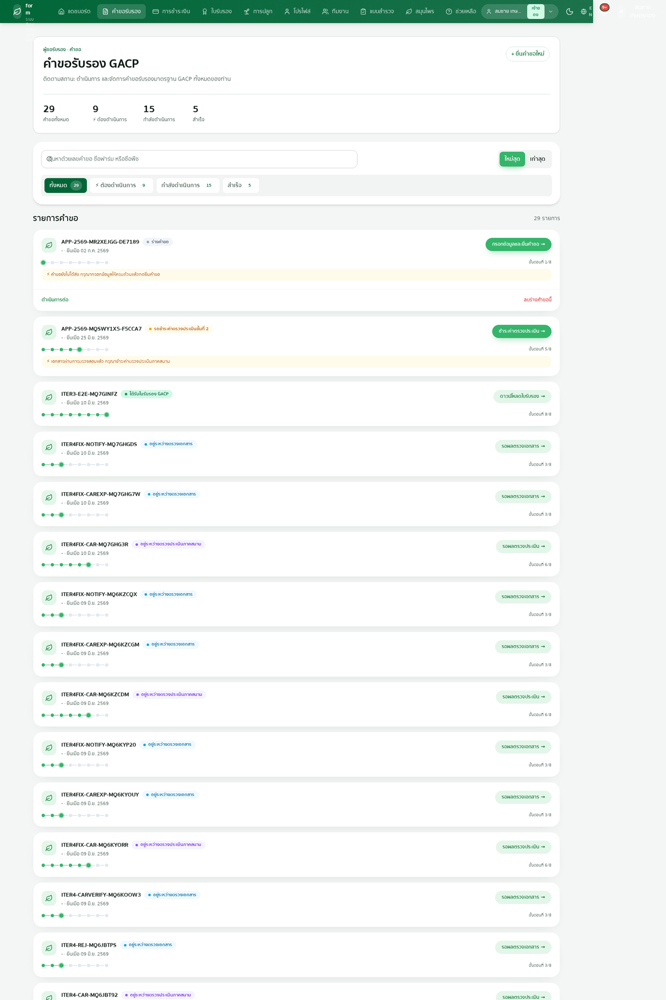
*ภาพที่ 13: หน้าคำขอรับรอง รวมคำขอทั้งหมดพร้อมสถานะและแถบความคืบหน้าของแต่ละรายการ*

1. เข้าเมนู คำขอรับรอง เพื่อดูคำขอทั้งหมดของคุณ
2. ใช้ช่องค้นหาหรือตัวกรองด้านบน เพื่อหาคำขอที่ต้องการ
3. กดปุ่ม ยื่นคำขอใหม่ ที่มุมขวาบนเพื่อเริ่มคำขอใหม่

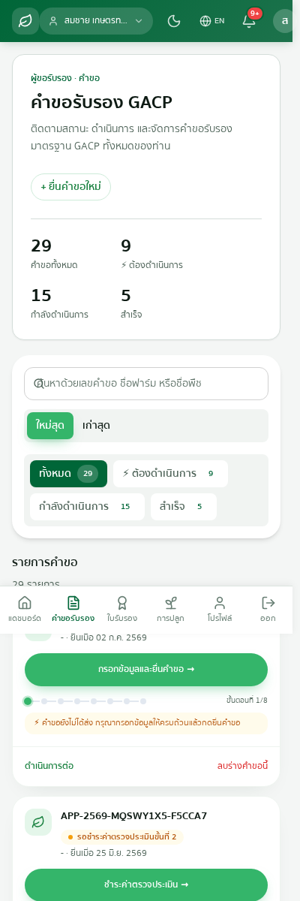
*ภาพที่ 14: หน้าคำขอรับรองบนโทรศัพท์มือถือ*

แบบฟอร์มยื่นคำขอมี 8 ขั้นตอน ระบบบันทึกข้อมูลให้ระหว่างกรอก จึงหยุดพักแล้วกลับมากรอกต่อได้

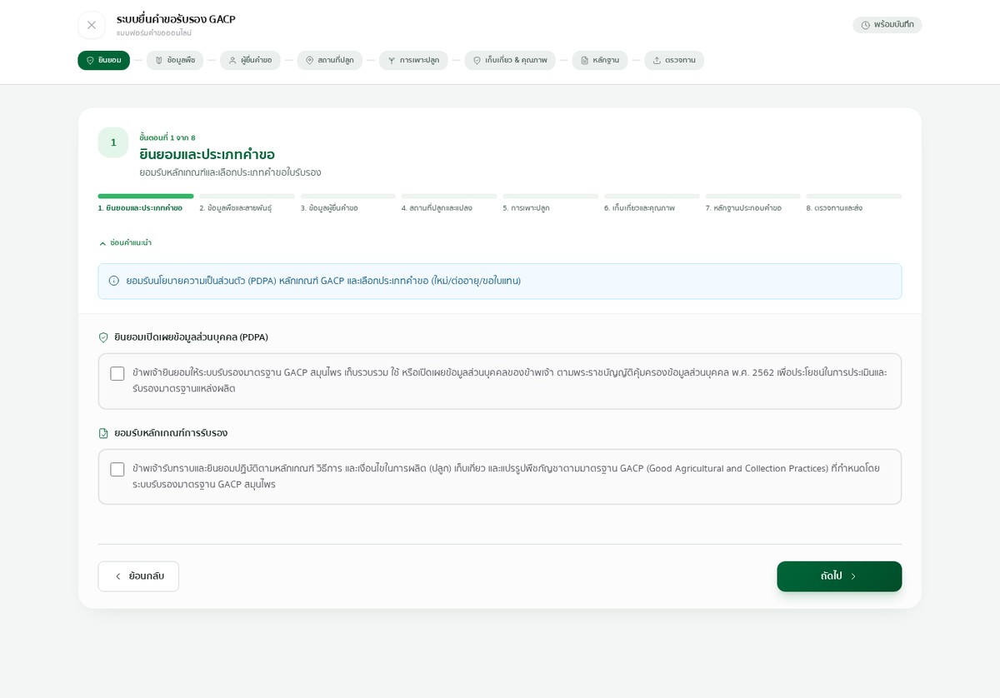
*ภาพที่ 15: แบบฟอร์มยื่นคำขอ ขั้นตอนที่ 1 การยินยอมเปิดเผยข้อมูลส่วนบุคคลและยอมรับหลักเกณฑ์*

1. อ่านและติ๊กยอมรับทั้ง 2 ข้อ คือการยินยอมด้านข้อมูลส่วนบุคคล และการยอมรับหลักเกณฑ์การรับรอง แล้วกด ถัดไป
2. กรอกข้อมูลทีละขั้นจนครบ 8 ขั้น ได้แก่ ข้อมูลพืชและสายพันธุ์ ข้อมูลผู้ยื่นคำขอ สถานที่ปลูก การเพาะปลูก การเก็บเกี่ยวและคุณภาพ และหลักฐานประกอบ
3. ขั้นสุดท้ายคือ ตรวจทานและส่ง เมื่อกดส่งแล้ว คำขอจะเข้าสู่สถานะรอชำระค่าตรวจเอกสารโดยอัตโนมัติ

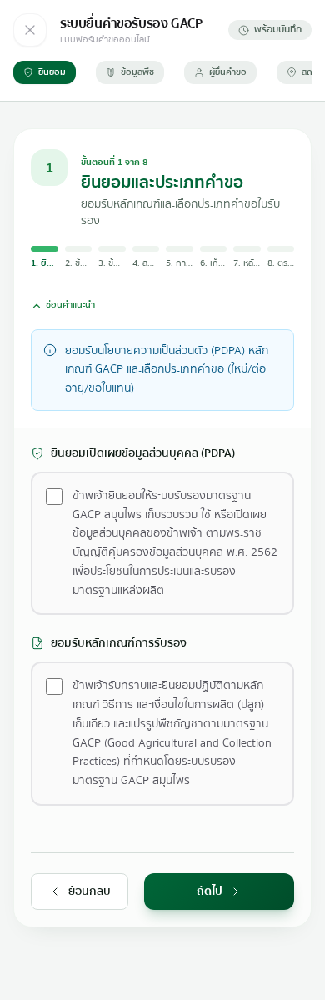
*ภาพที่ 16: แบบฟอร์มยื่นคำขอบนโทรศัพท์มือถือ กรอกได้ครบทุกขั้นตอนเช่นเดียวกับจอคอมพิวเตอร์*

### 2.7 ชำระเงิน (ใช้ทั้งงวดที่ 1 และงวดที่ 2)

เข้าเมนู การชำระเงิน จะพบยอดที่ต้องชำระของแต่ละงวด แต่ละงวดแยกเป็น 2 รายการ คือค่าธรรมเนียมส่วนของรัฐ และค่าบริการแพลตฟอร์ม แต่ละรายการโอนเข้าคนละบัญชี ระบบแสดงเลขบัญชีและรหัสคิวอาร์สำหรับสแกนจ่ายของแต่ละรายการไว้ชัดเจน

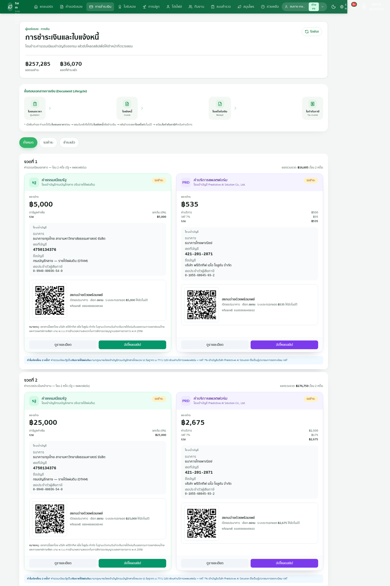
*ภาพที่ 17: หน้าการชำระเงินและใบแจ้งหนี้ แสดงยอดแต่ละงวด บัญชีปลายทาง รหัสคิวอาร์ และปุ่มอัปโหลดสลิป*

1. ดูการ์ดของงวดที่ต้องชำระ ตรวจยอดเงินและชื่อบัญชีปลายทางให้ตรงกับที่แสดง
2. สแกนรหัสคิวอาร์ด้วยแอปธนาคารของคุณ หรือโอนตามเลขบัญชีที่แสดง ยอดเงินจะถูกกรอกให้อัตโนมัติเมื่อสแกน
3. เมื่อโอนแล้ว กดปุ่ม อัปโหลดสลิป ของรายการนั้น แล้วแนบภาพสลิปโอนเงิน
4. รอเจ้าหน้าที่การเงินตรวจสลิป เมื่อผ่านแล้วสถานะคำขอจะเปลี่ยนไปขั้นถัดไปโดยอัตโนมัติ ติดตามได้จากแดชบอร์ด

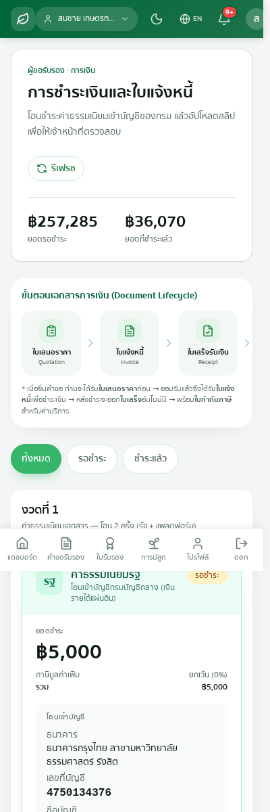
*ภาพที่ 18: หน้าการชำระเงินบนโทรศัพท์มือถือ สแกนจ่ายและอัปโหลดสลิปจากเครื่องเดียวกันได้*

> **หมายเหตุ: ฟีเจอร์นี้จะเปิดใช้เร็ว ๆ นี้**
> การตัดเงินออนไลน์แบบทันที เช่น จ่ายด้วยบัตร หรือพร้อมเพย์ที่ยืนยันการชำระให้อัตโนมัติโดยไม่ต้องส่งสลิป ยังไม่เปิดให้ใช้งาน
> วันนี้ทุกการชำระต้องแนบสลิปให้เจ้าหน้าที่ตรวจสอบก่อนเสมอ ระบบจึงจะเดินเรื่องต่อ

### 2.8 การตรวจเอกสาร และการแก้ไขตามคำแนะนำ

หลังชำระงวดที่ 1 แล้ว เจ้าหน้าที่จะตรวจเอกสารของคุณ ระหว่างนี้คำขอจะขึ้นสถานะอยู่ระหว่างตรวจเอกสาร คุณไม่ต้องทำอะไรเพิ่ม หากเจ้าหน้าที่พบจุดที่ต้องแก้ไข สถานะจะเปลี่ยนเป็นขอแก้ไข พร้อมข้อความบอกว่าต้องแก้อะไร

1. เมื่อได้รับแจ้งขอแก้ไข เปิดคำขอนั้นจากแดชบอร์ดหรือเมนู คำขอรับรอง
2. อ่านคำแนะนำจากผู้ตรวจ แล้วกดปุ่ม แก้ไขและส่งข้อมูลใหม่
3. แก้ไขข้อมูลหรือแนบเอกสารเพิ่ม แล้วกดส่งอีกครั้ง คำขอจะกลับเข้าคิวตรวจโดยไม่ต้องชำระเงินซ้ำ
4. ส่งกลับภายใน 5 วันทำการนับจากวันที่ได้รับแจ้ง ระบบแสดงเวลาที่เหลือไว้บนหน้าคำขอ หากพ้นกำหนดจะส่งซ้ำไม่ได้

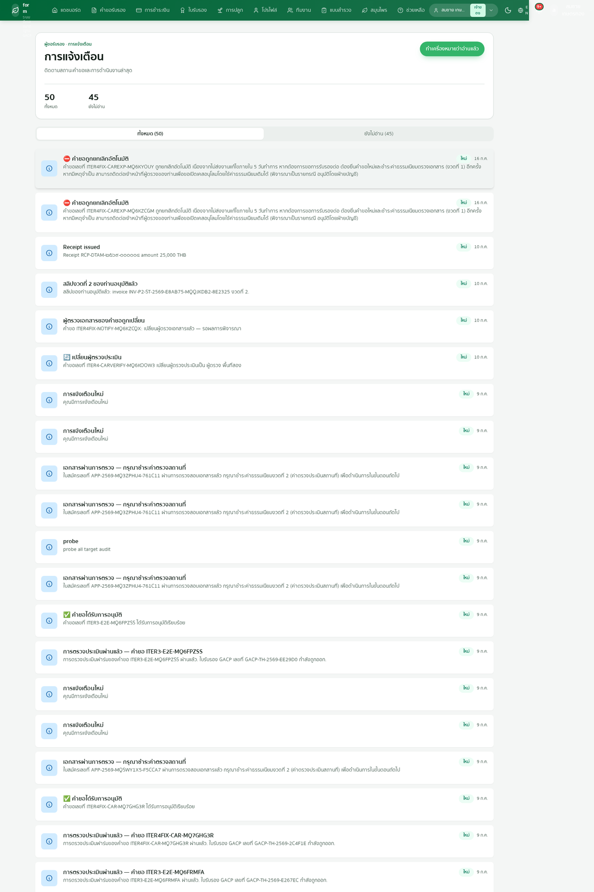
*ภาพที่ 19: หน้าการแจ้งเตือน รวมทุกความเคลื่อนไหวของคำขอ เช่น ผลตรวจเอกสาร คำขอให้แก้ไข และผลตรวจสลิป*

### 2.9 การนัดตรวจประเมินที่ฟาร์ม

เมื่อเอกสารผ่านและชำระงวดที่ 2 แล้ว คำขอจะเข้าสถานะรอนัดหมายลงพื้นที่ เจ้าหน้าที่ผู้ประสานงานจะจัดวันนัดและผู้ตรวจให้

> **หมายเหตุ: การแจ้งวันนัดยังอยู่นอกหน้าจอ**
> ขณะนี้หน้าจอของเกษตรกรยังไม่แสดงวันนัด เวลา และชื่อผู้ตรวจ
> เจ้าหน้าที่จะแจ้งนัดหมายให้คุณทราบทางโทรศัพท์หรือข้อความ กรุณารอการติดต่อและเตรียมฟาร์มให้พร้อมรับการตรวจ
> เมื่อระบบแสดงวันนัดในหน้าจอได้แล้ว คู่มือฉบับถัดไปจะอธิบายวิธีดูเพิ่มเติม

### 2.10 ผลการตรวจ และการส่งหลักฐานแก้ไขข้อบกพร่อง

หลังการตรวจที่ฟาร์ม หากผ่านการประเมิน ระบบจะออกใบรับรองให้โดยอัตโนมัติ หากพบข้อบกพร่องที่ต้องแก้ คำขอจะขึ้นข้อความ พบข้อบกพร่องจากการลงพื้นที่ กรุณาส่งหลักฐานการแก้ไข

1. เปิดคำขอนั้น แล้วกดปุ่ม ส่งหลักฐาน
2. แนบภาพถ่ายหรือเอกสารที่แสดงว่าแก้ไขแล้ว พร้อมคำอธิบายสั้น ๆ
3. กดส่ง แล้วรอผลการพิจารณาซ้ำ ติดตามสถานะได้จากแดชบอร์ดเช่นเดิม

### 2.11 ใบรับรองและรหัสคิวอาร์ (QR)

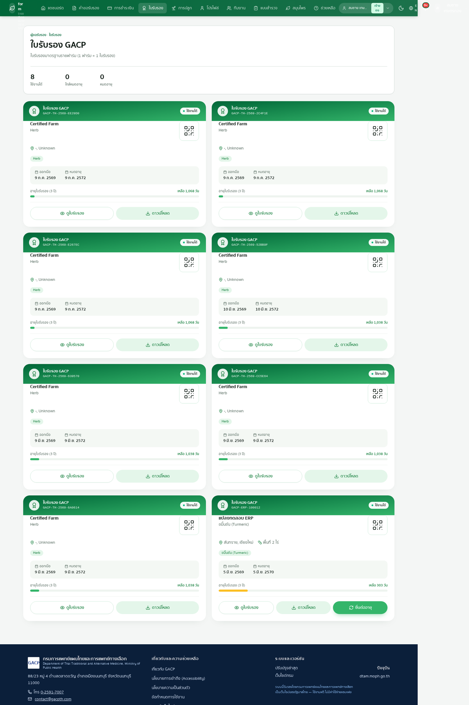
*ภาพที่ 20: หน้าใบรับรอง แสดงใบรับรองทุกใบ เลขที่ วันออกและวันหมดอายุ พร้อมรหัสคิวอาร์*

1. เข้าเมนู ใบรับรอง ดูใบรับรองทั้งหมดของคุณ การ์ดแต่ละใบแสดงเลขที่ใบรับรอง วันออก วันหมดอายุ และอายุที่เหลือ
2. กดปุ่ม ดูใบรับรอง เพื่อเปิดรายละเอียด หรือกดปุ่ม ดาวน์โหลด เพื่อบันทึกไฟล์ใบรับรองที่มีรหัสคิวอาร์ฝังอยู่
3. พิมพ์ใบรับรองหรือแสดงรหัสคิวอาร์ให้คู่ค้าสแกนได้ ผู้สแกนจะเห็นข้อมูลการรับรองโดยไม่เห็นข้อมูลส่วนตัวของคุณ
4. ใบที่ใกล้หมดอายุจะมีปุ่ม ยื่นต่ออายุ ปรากฏบนการ์ด

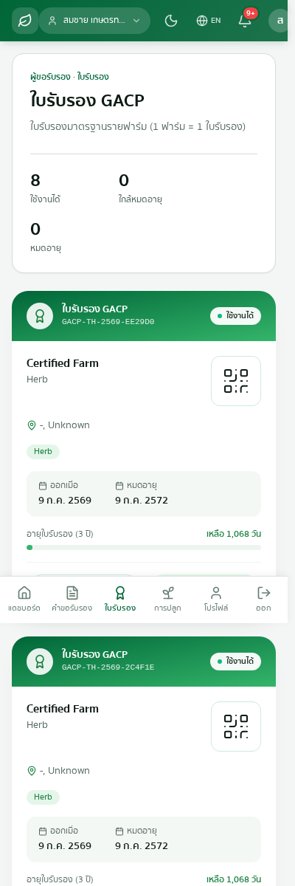
*ภาพที่ 21: หน้าใบรับรองบนโทรศัพท์มือถือ เปิดแสดงรหัสคิวอาร์จากหน้าจอได้ทันที*

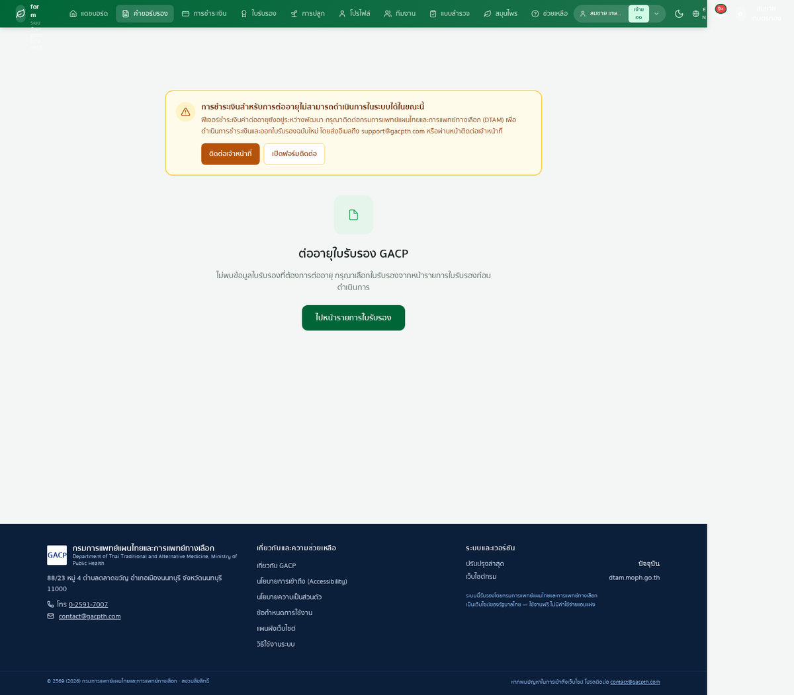
*ภาพที่ 22: หน้ายื่นต่ออายุใบรับรอง ขณะนี้การชำระค่าต่ออายุในระบบยังไม่เปิดให้ใช้งาน*

> **หมายเหตุ: การชำระค่าต่ออายุในระบบจะเปิดใช้เร็ว ๆ นี้**
> การชำระค่าธรรมเนียมต่ออายุผ่านระบบยังอยู่ระหว่างพัฒนา
> หากใบรับรองใกล้หมดอายุ กรุณาติดต่อกรมการแพทย์แผนไทยและการแพทย์ทางเลือกผ่านปุ่ม ติดต่อเจ้าหน้าที่ ในหน้านั้น เพื่อดำเนินการต่ออายุ

### 2.12 เอกสารทางการทั้งหมดของคุณ

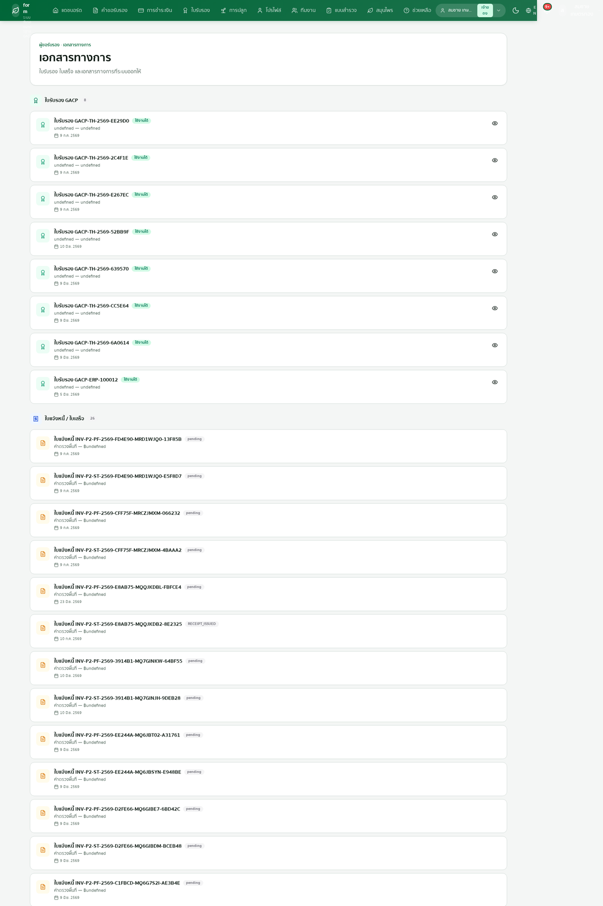
*ภาพที่ 23: หน้าเอกสารทางการ รวมใบรับรอง ใบแจ้งหนี้ และใบเสร็จทุกฉบับไว้ที่เดียว*

1. เข้าเมนู โปรไฟล์ แล้วเลือก เอกสารทางการ จะพบใบรับรองและใบแจ้งหนี้ทุกฉบับเรียงตามวันที่
2. กดรูปดวงตาท้ายรายการเพื่อเปิดดูเอกสารฉบับเต็ม
3. เอกสารทุกฉบับที่ระบบออกให้มีรหัสคิวอาร์กำกับ ใช้ตรวจสอบความถูกต้องย้อนกลับได้เสมอ

### 2.13 โปรไฟล์และการตั้งค่าบัญชี

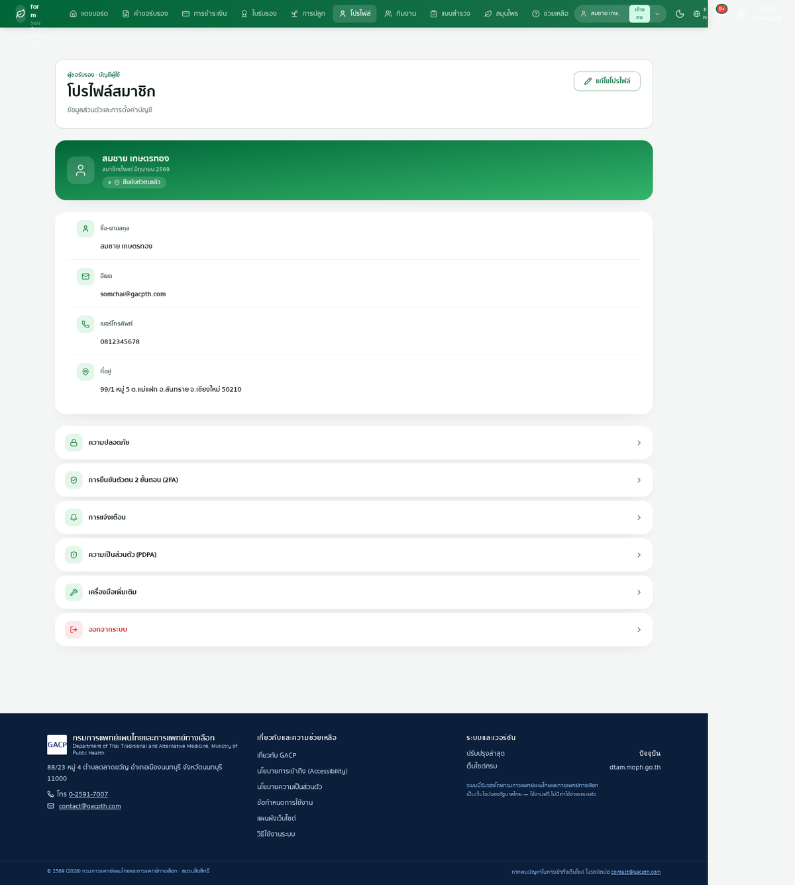
*ภาพที่ 24: หน้าโปรไฟล์สมาชิก แก้ไขข้อมูลติดต่อ ตั้งค่าความปลอดภัย การแจ้งเตือน และความเป็นส่วนตัว*

1. เข้าเมนู โปรไฟล์ ตรวจดูชื่อ อีเมล เบอร์โทรศัพท์ และที่อยู่ให้เป็นปัจจุบัน กดปุ่ม แก้ไขโปรไฟล์ เมื่อต้องการเปลี่ยน
2. เมนูย่อย ความปลอดภัย ใช้เปลี่ยนรหัสผ่าน และเปิดการยืนยันตัวตน 2 ขั้นตอนได้
3. เมนูย่อย การแจ้งเตือน ใช้เลือกช่องทางรับข่าวสถานะคำขอ และเมนู ออกจากระบบ อยู่ล่างสุดของหน้านี้

---

## บทที่ 3  ระบบฟาร์ม ทีมงาน และแปลงปลูก

ข้อมูลฟาร์มเป็นฐานของทุกอย่างในระบบ ทั้งการยื่นคำขอ การปลูก และการตามสอบย้อนกลับ บทนี้อธิบายการสร้างพื้นที่ทำงาน การลงทะเบียนฟาร์ม และการเพิ่มแปลงปลูก

### 3.1 พื้นที่ทำงานและทีมงาน

พื้นที่ทำงาน (Workspace) คือกลุ่มของฟาร์มและคำขอที่จัดการร่วมกัน คุณมีพื้นที่ส่วนตัวของตัวเองเสมอ และสร้างพื้นที่แบบนิติบุคคลหรือวิสาหกิจชุมชนเพิ่มได้เมื่อยื่นในนามองค์กร

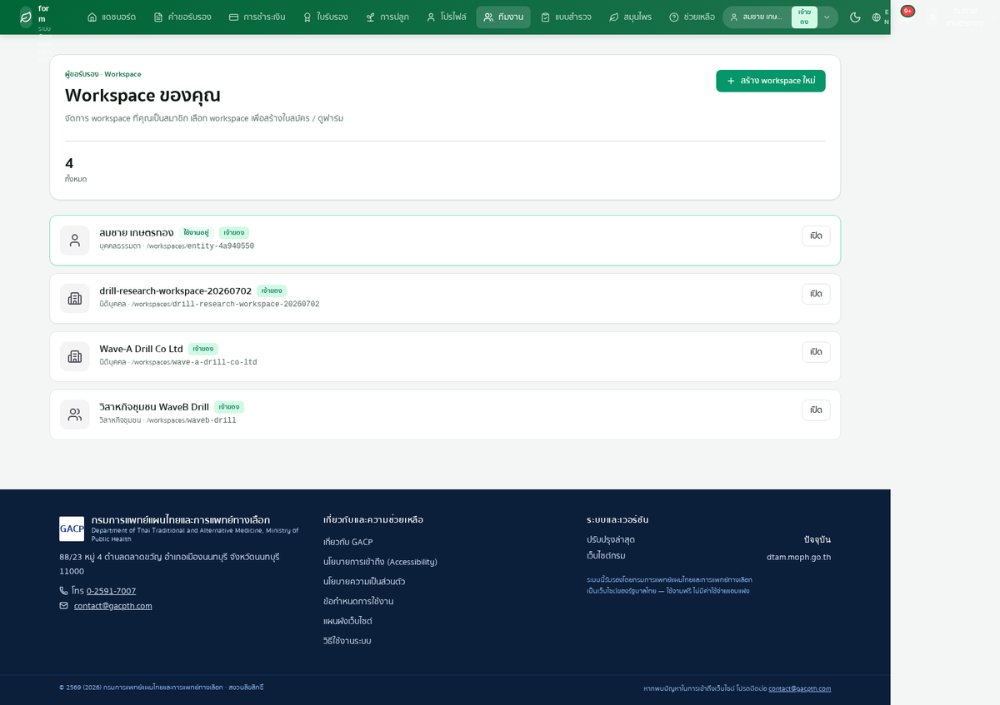
*ภาพที่ 25: หน้าพื้นที่ทำงาน แสดงพื้นที่ทั้งหมดที่คุณเป็นสมาชิก ทั้งแบบบุคคลธรรมดา นิติบุคคล และวิสาหกิจชุมชน*

1. เข้าเมนู ทีมงาน จะเห็นพื้นที่ทำงานทั้งหมดของคุณ พร้อมป้ายบอกประเภทและบทบาทของคุณในพื้นที่นั้น
2. กดปุ่ม เปิด ท้ายรายการ เพื่อสลับไปทำงานในพื้นที่นั้น คำขอและฟาร์มที่เห็นจะเปลี่ยนตามพื้นที่ที่เลือก
3. กดปุ่ม สร้างพื้นที่ทำงานใหม่ เมื่อต้องยื่นคำขอในนามบริษัทหรือกลุ่มวิสาหกิจ

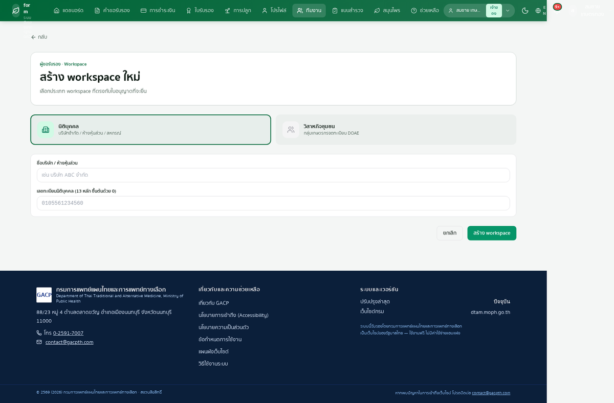
*ภาพที่ 26: หน้าสร้างพื้นที่ทำงานใหม่ เลือกประเภทนิติบุคคลหรือวิสาหกิจชุมชน พร้อมกรอกเลขทะเบียน 13 หลัก*

### 3.2 สถานประกอบการและฟาร์มของคุณ

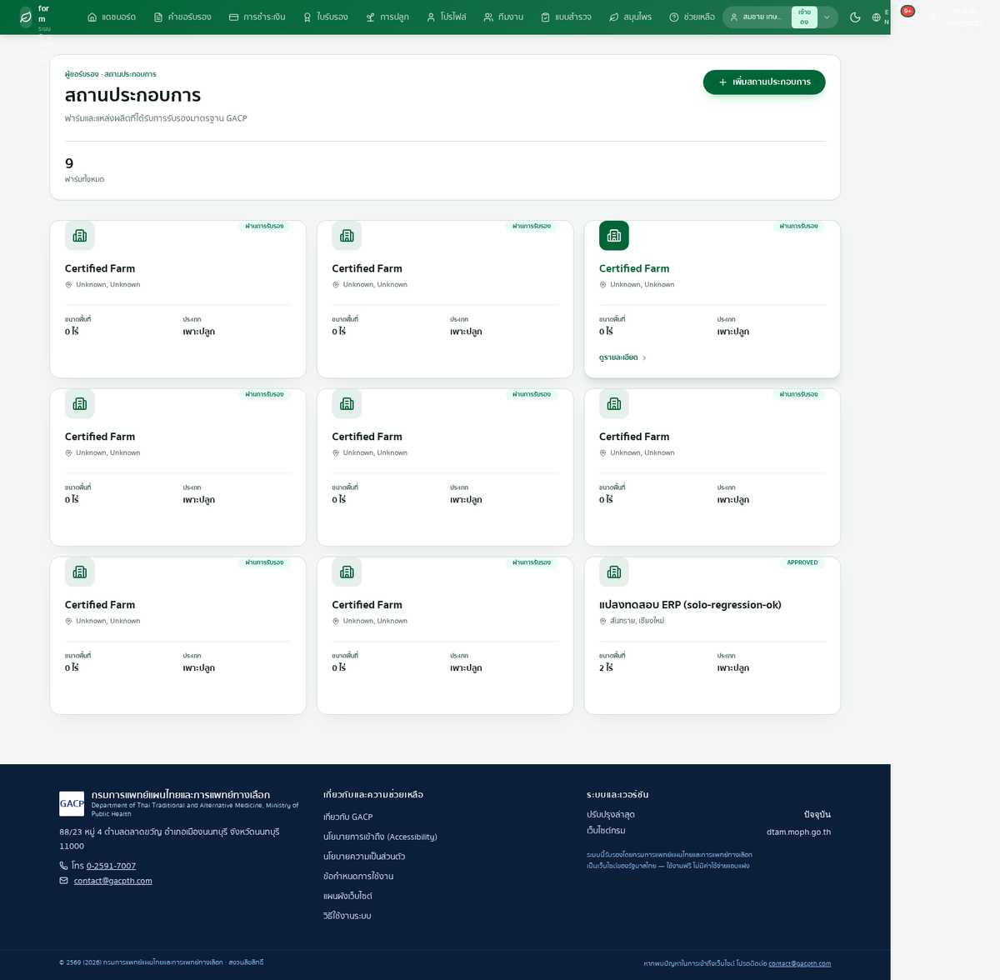
*ภาพที่ 27: หน้าสถานประกอบการ รวมฟาร์มทั้งหมดของคุณและสถานะการรับรองของแต่ละแห่ง*

1. เข้าเมนู โปรไฟล์ แล้วเลือก สถานประกอบการ หรือเข้าจากลิงก์ในหน้าตรวจสอบความพร้อม
2. ตรวจดูการ์ดฟาร์มแต่ละแห่ง ป้ายมุมขวาบอกว่าผ่านการรับรองแล้วหรือไม่ กด ดูรายละเอียด เพื่อเปิดข้อมูลเต็ม
3. ข้อมูลฟาร์มที่ลงทะเบียนไว้จะถูกดึงไปใช้ตอนยื่นคำขอโดยอัตโนมัติ ไม่ต้องกรอกซ้ำ

### 3.3 ลงทะเบียนสถานที่เพาะปลูกใหม่

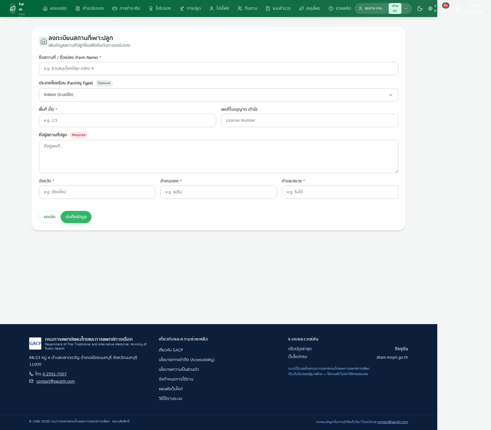
*ภาพที่ 28: แบบฟอร์มลงทะเบียนสถานที่เพาะปลูก กรอกชื่อแปลง ประเภทโรงเรือน พื้นที่ และที่ตั้ง*

1. กดปุ่ม เพิ่มสถานประกอบการ จากหน้าสถานประกอบการ
2. กรอกชื่อสถานที่หรือชื่อแปลง เลือกประเภทโรงเรือน เช่น ระบบปิด หรือกลางแจ้ง แล้วกรอกพื้นที่เป็นไร่
3. กรอกที่อยู่ จังหวัด อำเภอ ตำบล ให้ครบ แล้วกดปุ่ม บันทึกข้อมูล ฟาร์มใหม่จะปรากฏในหน้าสถานประกอบการทันที

---

## บทที่ 4  ระบบการปลูก

ระบบการปลูกใช้บันทึกรอบการปลูกจริงในฟาร์มที่ได้รับการรับรองแล้ว ตั้งแต่วันเริ่มปลูกจนถึงเก็บเกี่ยว ข้อมูลส่วนนี้คือจุดเริ่มต้นของการตามสอบย้อนกลับในบทที่ 6

### 4.1 รอบการปลูกของฉัน

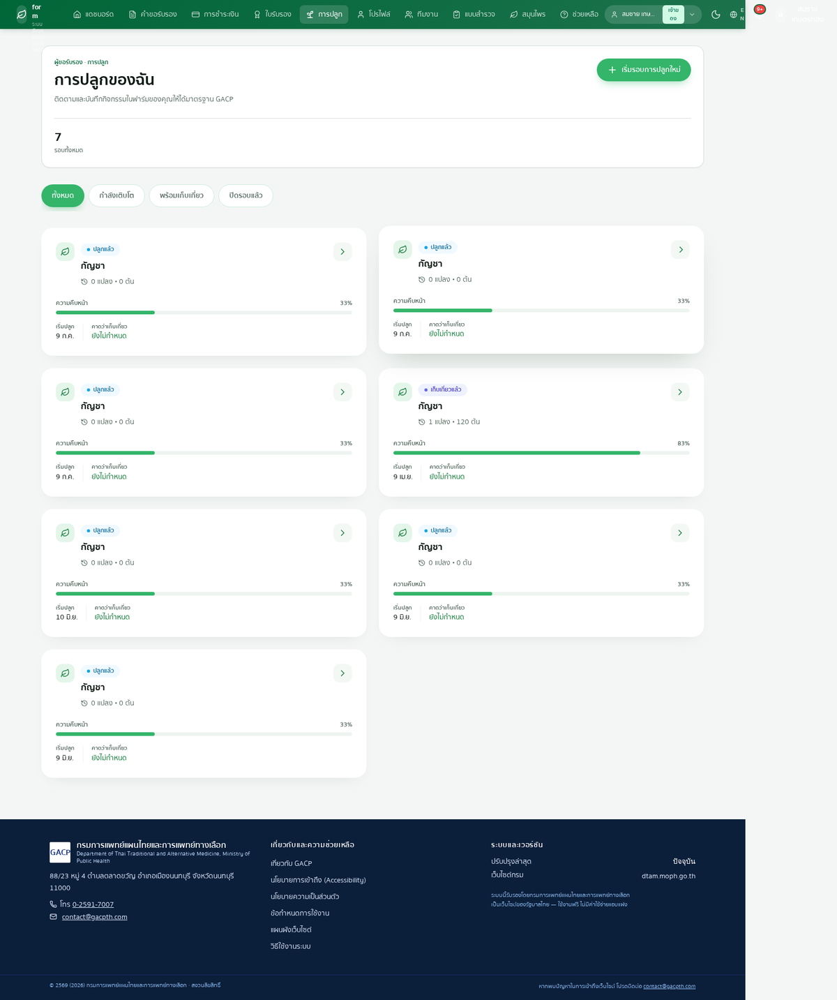
*ภาพที่ 29: หน้าการปลูกของฉัน แสดงรอบปลูกทุกรอบ สถานะ ความคืบหน้า และวันที่เริ่มปลูก*

1. เข้าเมนู การปลูก จะเห็นรอบปลูกทั้งหมด การ์ดแต่ละใบบอกชนิดพืช สถานะ เช่น ปลูกแล้ว หรือเก็บเกี่ยวแล้ว พร้อมแถบความคืบหน้า
2. ใช้ปุ่มกรองด้านบน เช่น กำลังเติบโต พร้อมเก็บเกี่ยว หรือปิดรอบแล้ว เพื่อดูเฉพาะกลุ่มที่สนใจ
3. กดที่การ์ดเพื่อเปิดรายละเอียดรอบปลูก และบันทึกกิจกรรมของรอบนั้น

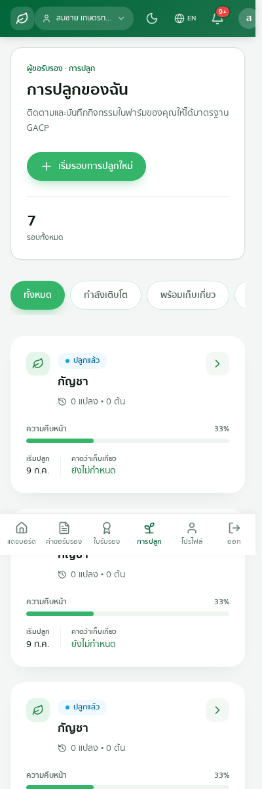
*ภาพที่ 30: หน้าการปลูกบนโทรศัพท์มือถือ บันทึกจากหน้าแปลงได้สะดวก*

### 4.2 เริ่มรอบการปลูกใหม่

การเปิดรอบปลูกใหม่มี 4 ขั้นตอน คือ เลือกฟาร์มและใบรับรอง เลือกแปลงและพื้นที่ใช้งาน ตั้งค่ารอบปลูก และตรวจสรุปก่อนบันทึก รอบปลูกต้องอ้างอิงฟาร์มที่มีใบรับรองที่ยังใช้งานได้

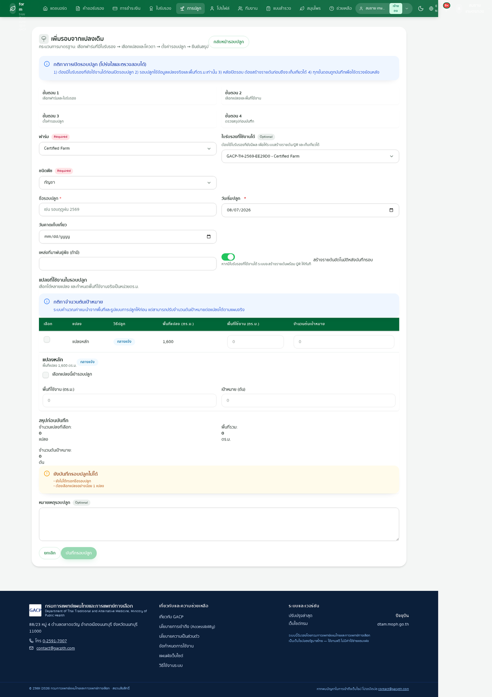
*ภาพที่ 31: แบบฟอร์มเริ่มรอบการปลูกใหม่ เลือกฟาร์ม ใบรับรอง ชนิดพืช แปลง และจำนวนต้นเป้าหมาย*

1. กดปุ่ม เริ่มรอบการปลูกใหม่ จากหน้าการปลูก แล้วเลือกฟาร์ม ใบรับรอง และชนิดพืช
2. ตั้งชื่อรอบปลูก เช่น รอบฤดูฝน 2569 กรอกวันเริ่มปลูก และวันคาดว่าจะเก็บเกี่ยว
3. เลือกแปลงที่ใช้ พร้อมระบุพื้นที่ใช้งานจริงและจำนวนต้นเป้าหมาย ระบบจะแนะนำค่าให้ตามขนาดแปลง
4. เปิดตัวเลือก สร้างรายต้นอัตโนมัติหลังบันทึกรอบ หากต้องการให้ระบบสร้างข้อมูลรายต้นพร้อมรหัสคิวอาร์ให้ทันที แล้วตรวจสรุปและกด บันทึกรอบปลูก

### 4.3 บันทึกการอบรมบุคลากร

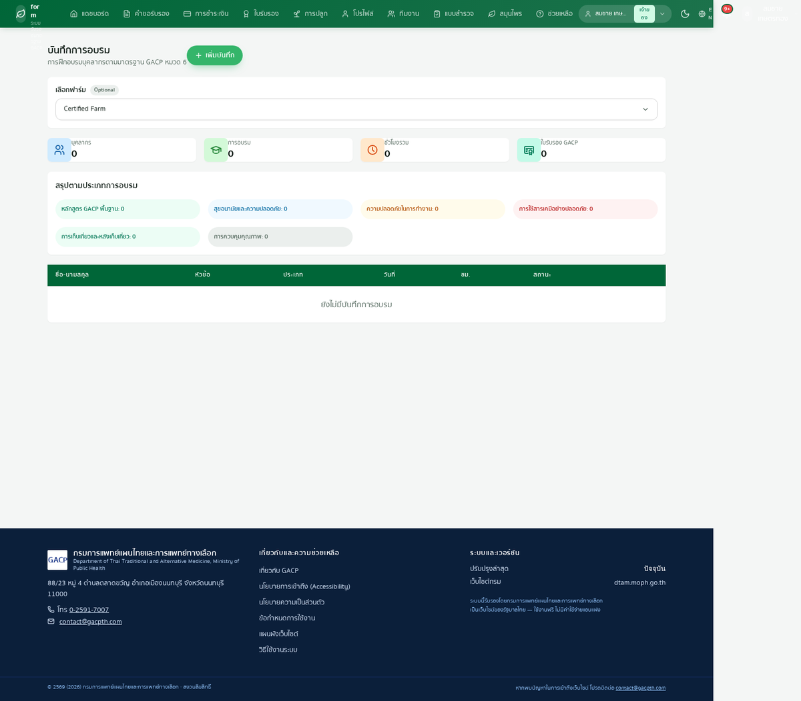
*ภาพที่ 32: หน้าบันทึกการอบรม เก็บประวัติการฝึกอบรมของคนในฟาร์มตามหมวดที่มาตรฐานกำหนด*

1. เข้าเมนู การปลูก แล้วเลือก บันทึกการอบรม เพื่อเก็บประวัติการอบรมของบุคลากรในฟาร์ม
2. กดปุ่ม เพิ่มบันทึก กรอกชื่อผู้เข้าอบรม หัวข้อ ประเภท วันที่ และจำนวนชั่วโมง
3. ประวัติการอบรมเป็นหลักฐานประกอบการตรวจประเมิน ผู้ตรวจอาจขอดูระหว่างลงพื้นที่

---

## บทที่ 5  ฐานข้อมูลสมุนไพร

ระบบมีฐานความรู้สมุนไพร 6 ชนิด ได้แก่ กัญชา ขมิ้นชัน ขิง กระชายดำ ไพล และกระท่อม แต่ละชนิดรวมข้อมูลพันธุ์ สารสำคัญ วิธีการปลูก การเก็บเกี่ยว การแปรรูป และข้อกฎหมายที่เกี่ยวข้อง

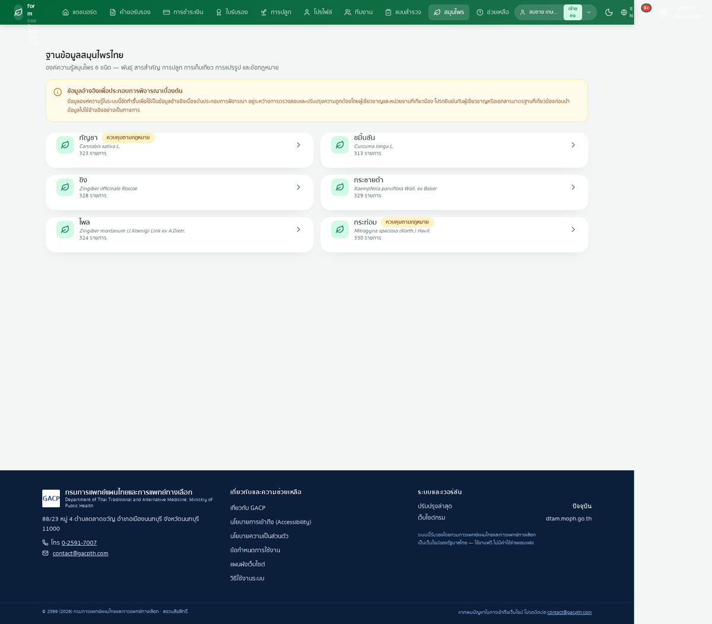
*ภาพที่ 33: ฐานข้อมูลสมุนไพรไทย 6 ชนิด ชนิดที่มีป้ายกำกับคือพืชที่มีการควบคุมตามกฎหมาย*

1. เข้าเมนู สมุนไพร แล้วเลือกชนิดพืชที่ต้องการ
2. อ่านรายละเอียดแต่ละหมวด เช่น การเตรียมดิน ระยะปลูก และช่วงเวลาเก็บเกี่ยวที่เหมาะสม
3. พืชที่มีป้าย ควบคุมตามกฎหมาย เช่น กัญชาและกระท่อม มีข้อกำหนดเพิ่มเติมที่ต้องปฏิบัติตาม โปรดอ่านหมวดข้อกฎหมายก่อนปลูก

> **ข้อควรทราบ**
> ข้อมูลในฐานความรู้นี้จัดทำเพื่อเป็นข้อมูลอ้างอิงเบื้องต้น อยู่ระหว่างการตรวจสอบความถูกต้องโดยผู้เชี่ยวชาญ
> ก่อนนำไปใช้อ้างอิงอย่างเป็นทางการ โปรดยืนยันกับผู้เชี่ยวชาญหรือเอกสารมาตรฐานที่เกี่ยวข้อง

---

## บทที่ 6  รหัสคิวอาร์และการตามสอบย้อนกลับ (จากเมล็ดถึงมือผู้ซื้อ)

จุดแข็งของระบบ GACP คือทุกขั้นของการผลิตถูกบันทึกและตามสอบย้อนกลับได้ ผู้ซื้อที่สแกนรหัสคิวอาร์บนสินค้า สามารถไล่ย้อนได้ว่าสมุนไพรนี้มาจากล็อตไหน รอบปลูกไหน แปลงไหน และฟาร์มที่ได้รับการรับรองใบใด

รหัสคิวอาร์ในระบบมี 4 แบบ ไล่ตามลำดับการผลิต ดังนี้

| รหัสคิวอาร์ | ติดอยู่ที่ไหน บอกอะไร |
|---|---|
| 1. ใบรับรองฟาร์ม | อยู่บนใบรับรอง GACP ยืนยันว่าฟาร์มผ่านการรับรอง (ดูบทที่ 2) |
| 2. รายต้น | กำกับต้นพืชแต่ละต้นที่ระบบสร้างให้เมื่อเปิดรอบปลูก (ดูบทที่ 4) |
| 3. แปลงและรอบปลูก | กำกับรอบการปลูกของแต่ละแปลง ใช้ติดตามกิจกรรมระหว่างปลูก |
| 4. ล็อตผลผลิต | ติดบนบรรจุภัณฑ์หลังเก็บเกี่ยวและแบ่งบรรจุ ผู้ซื้อสแกนแบบนี้ |

### 6.1 ระบบติดตามผลผลิต

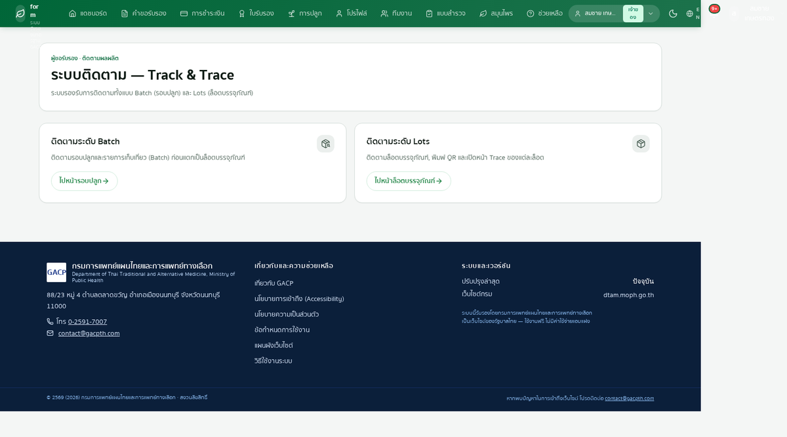
*ภาพที่ 34: หน้าระบบติดตาม แยกการติดตามเป็นระดับรอบปลูกและระดับล็อตบรรจุภัณฑ์*

1. เข้าเมนู การปลูก แล้วเลือก ติดตามผลผลิต จะพบทางเข้า 2 ทาง คือระดับรอบปลูก และระดับล็อตบรรจุภัณฑ์
2. ระดับรอบปลูกใช้ติดตามการปลูกและการเก็บเกี่ยวก่อนแบ่งบรรจุ
3. ระดับล็อตใช้จัดการบรรจุภัณฑ์ พิมพ์รหัสคิวอาร์ และเปิดดูหน้าตามสอบของแต่ละล็อต

### 6.2 สร้างล็อตผลผลิตและพิมพ์รหัสคิวอาร์

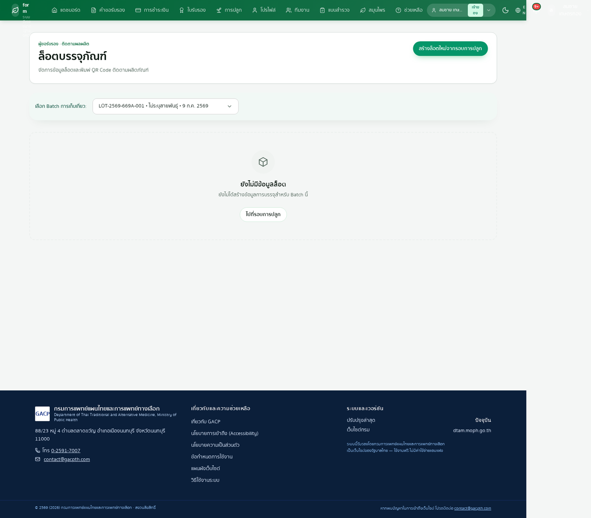
*ภาพที่ 35: หน้าล็อตบรรจุภัณฑ์ เลือกรอบเก็บเกี่ยวเพื่อสร้างล็อตใหม่และพิมพ์รหัสคิวอาร์ติดบรรจุภัณฑ์*

1. หลังเก็บเกี่ยว เข้าหน้า ล็อตบรรจุภัณฑ์ แล้วเลือกรอบเก็บเกี่ยวที่ต้องการแบ่งบรรจุ
2. กดปุ่ม สร้างล็อตใหม่จากรอบการปลูก กรอกจำนวนและขนาดบรรจุ
3. พิมพ์รหัสคิวอาร์ของล็อตออกมาติดบนบรรจุภัณฑ์ทุกชิ้นก่อนส่งขาย

### 6.3 หน้าตรวจสอบแหล่งที่มาสำหรับผู้ซื้อ

ผู้ซื้อหรือผู้บริโภคไม่ต้องมีบัญชีในระบบ เพียงสแกนรหัสคิวอาร์บนบรรจุภัณฑ์ หรือเปิดหน้าตรวจสอบแหล่งที่มาแล้วกรอกรหัสล็อตด้วยตนเอง

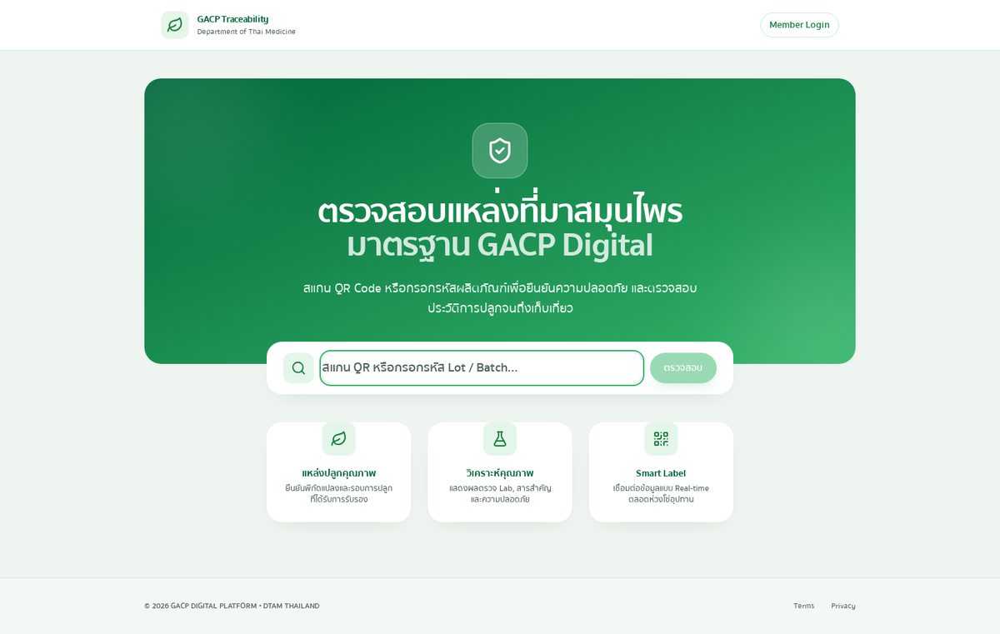
*ภาพที่ 36: หน้าตรวจสอบแหล่งที่มาสมุนไพร สแกนรหัสคิวอาร์หรือกรอกรหัสล็อตเพื่อดูประวัติการปลูกจนถึงเก็บเกี่ยว*

1. สแกนรหัสคิวอาร์บนบรรจุภัณฑ์ด้วยกล้องโทรศัพท์ หรือกรอกรหัสล็อตในช่องตรวจสอบ
2. กดปุ่ม ตรวจสอบ ระบบจะแสดงแหล่งปลูก รอบการปลูก และข้อมูลการรับรองของฟาร์มต้นทาง
3. ใช้ยืนยันความปลอดภัยของสินค้าก่อนซื้อ หรือแนบให้คู่ค้าตรวจสอบเองได้

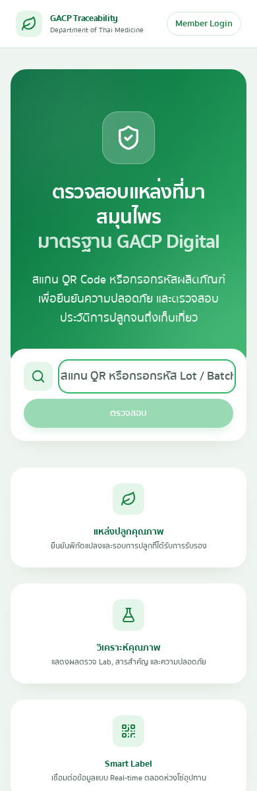
*ภาพที่ 37: หน้าตรวจสอบแหล่งที่มาบนโทรศัพท์มือถือ เหมาะกับการสแกนหน้าร้าน*

> **หมายเหตุ: เปิดใช้ครบทุกส่วนเร็ว ๆ นี้**
> ระบบตามสอบย้อนกลับกำลังทยอยเปิดใช้ทีละส่วน บางล็อตหรือบางรอบปลูกอาจยังไม่มีข้อมูลให้แสดงครบทุกขั้น
> หากสแกนแล้วไม่พบข้อมูล ให้ตรวจสอบใบรับรองฟาร์มต้นทางแทนได้เสมอ (ภาคผนวก ก)

---

## บทที่ 7  ระบบแบบสำรวจ

ระบบแบบสำรวจใช้รับฟังความต้องการของเกษตรกรและผู้ใช้งาน เพื่อนำไปพัฒนาระบบและบริการ เกษตรกรเป็นผู้ตอบ ส่วนเจ้าหน้าที่เป็นผู้สร้างแบบสำรวจและอ่านผล

### 7.1 ตอบแบบสำรวจ (สำหรับเกษตรกร)

*ภาพที่ 38: หน้าแบบสำรวจของเกษตรกร แสดงแบบสำรวจที่เปิดรับคำตอบพร้อมจำนวนคำถาม*

1. เข้าเมนู แบบสำรวจ จะเห็นแบบสำรวจที่เปิดรับคำตอบอยู่
2. กดที่แบบสำรวจ ตอบคำถามทีละข้อ แล้วกดส่งคำตอบ
3. คำตอบของคุณช่วยให้หน่วยงานปรับปรุงบริการให้ตรงความต้องการมากขึ้น

### 7.2 สร้างแบบสำรวจและอ่านผล (สำหรับเจ้าหน้าที่)

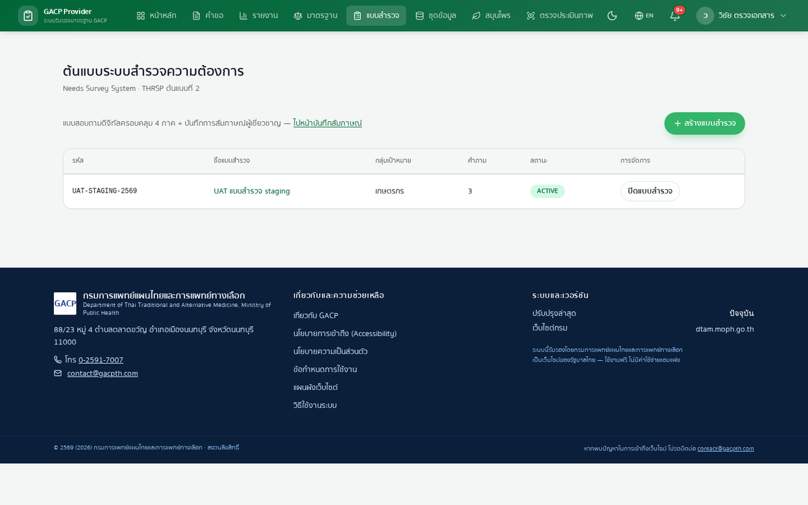
*ภาพที่ 39: หน้าจัดการแบบสำรวจฝั่งเจ้าหน้าที่ สร้างแบบสำรวจใหม่ กำหนดกลุ่มเป้าหมาย และปิดแบบสำรวจ*

1. เข้าเมนู แบบสำรวจ ในระบบเจ้าหน้าที่ จะเห็นแบบสำรวจทั้งหมดพร้อมสถานะ
2. กดปุ่ม สร้างแบบสำรวจ กำหนดชื่อ กลุ่มเป้าหมาย และคำถาม
3. เมื่อเก็บคำตอบครบแล้ว กดปุ่ม ปิดแบบสำรวจ เพื่อหยุดรับคำตอบ

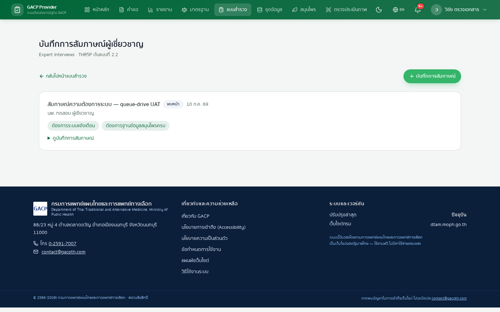
*ภาพที่ 40: หน้าบันทึกการสัมภาษณ์ผู้เชี่ยวชาญ เก็บสรุปประเด็นจากการสัมภาษณ์คู่กับผลแบบสำรวจ*

---

## บทที่ 8  สำหรับเจ้าหน้าที่ผู้ตรวจเอกสาร

ผู้ตรวจเอกสารรับผิดชอบการตรวจคำขอที่ชำระค่าตรวจเอกสารแล้วและถูกมอบหมายให้ตน โดยตัดสินได้ 2 ทางคือ อนุมัติ หรือ ขอแก้ไขพร้อมระบุเหตุผล

### 8.1 หน้าหลักผู้ตรวจเอกสาร

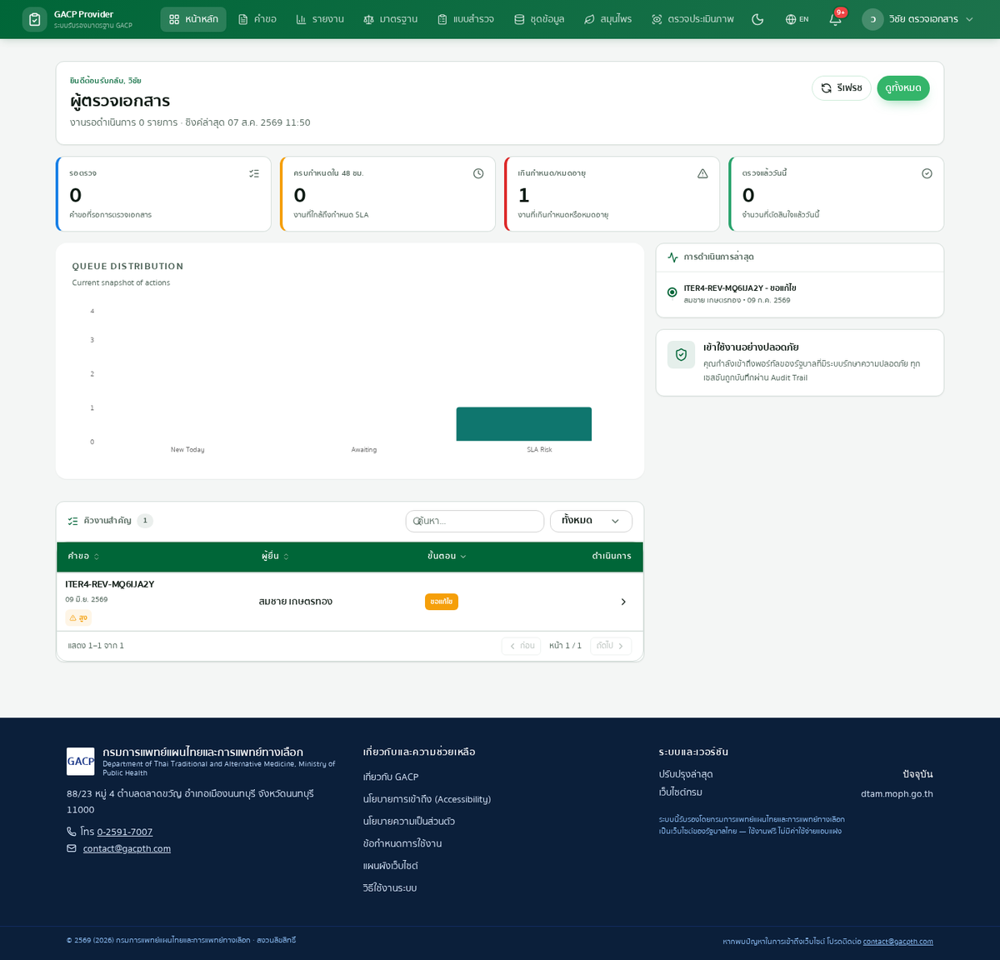
*ภาพที่ 41: หน้าหลักผู้ตรวจเอกสาร สรุปงานรอตรวจ งานใกล้ครบกำหนด และคิวงานสำคัญ*

1. ดูการ์ดสรุป 4 ใบด้านบน คือ รอตรวจ ครบกำหนดใน 48 ชั่วโมง เกินกำหนดหรือหมดอายุ และตรวจแล้ววันนี้
2. ดูตาราง คิวงานสำคัญ เรียงตามความเร่งด่วน กดที่แถวเพื่อเปิดคำขอนั้น
3. กดปุ่ม ดูทั้งหมด เพื่อไปหน้ารายการคำขอเต็ม

### 8.2 เปิดคำขอและตัดสินผลการตรวจ

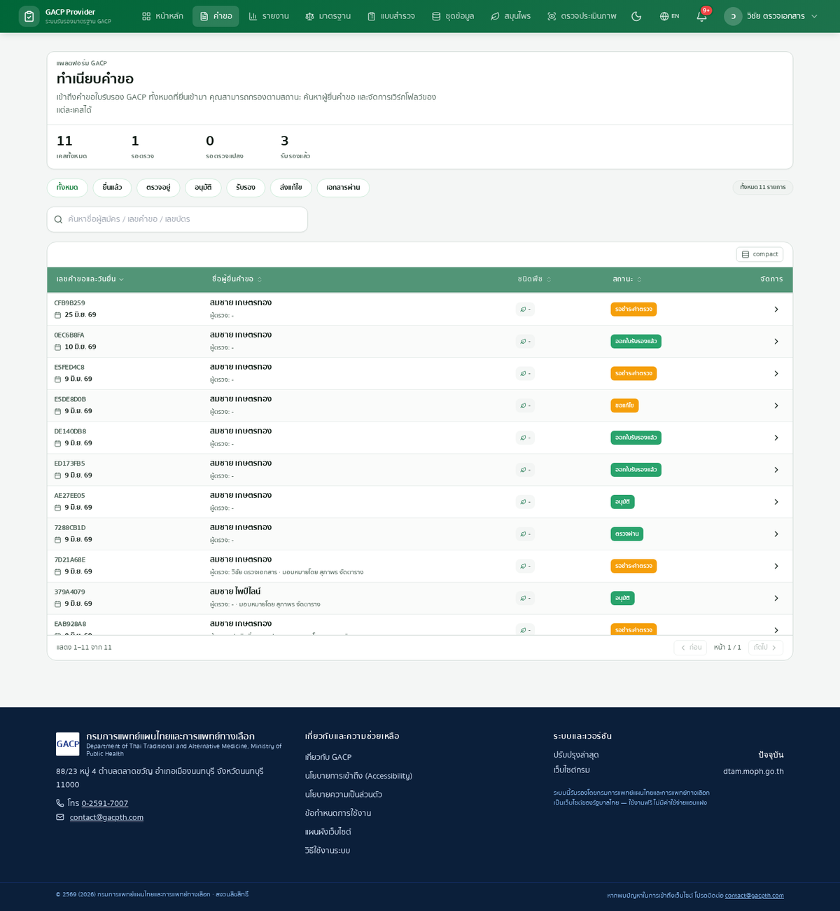
*ภาพที่ 42: หน้าทำเนียบคำขอ กรองตามสถานะ ค้นหาผู้ยื่น และเปิดดูรายละเอียดแต่ละคำขอ*

1. เลือกแถบสถานะด้านบน เช่น ตรวจอยู่ หรือ ส่งแก้ไข หรือพิมพ์ชื่อผู้สมัครหรือเลขคำขอในช่องค้นหา
2. กดที่คำขอเพื่อเปิดหน้ารายละเอียด ตรวจเอกสารแนบทีละรายการตามรายการตรวจบนจอ
3. กด อนุมัติ เมื่อเอกสารครบถ้วนถูกต้อง หรือกด ขอแก้ไข พร้อมพิมพ์เหตุผลให้เกษตรกรทราบว่าต้องแก้อะไร ระบบบังคับให้กรอกเหตุผลทุกครั้งที่ขอแก้ไข

รายการตรวจ 9 หมวดที่แสดงบนหน้าตรวจเป็นแนวทางอ้างอิงสำหรับผู้ตรวจ ระบบไม่บังคับให้ติ๊กครบทุกข้อก่อนกดอนุมัติ ผู้ตรวจจึงควรไล่ตรวจให้ครบด้วยตนเองก่อนตัดสิน

---

## บทที่ 9  สำหรับเจ้าหน้าที่ผู้ประสานงานนัดตรวจ

ผู้ประสานงานจัดคิวและมอบหมายงานให้ผู้ตรวจ ทั้งการมอบหมายผู้ตรวจเอกสารและการนัดหมายตรวจประเมินที่ฟาร์ม พร้อมเฝ้าระวังงานที่ใกล้เกินกำหนด

### 9.1 ศูนย์ควบคุมการจัดสรรงาน

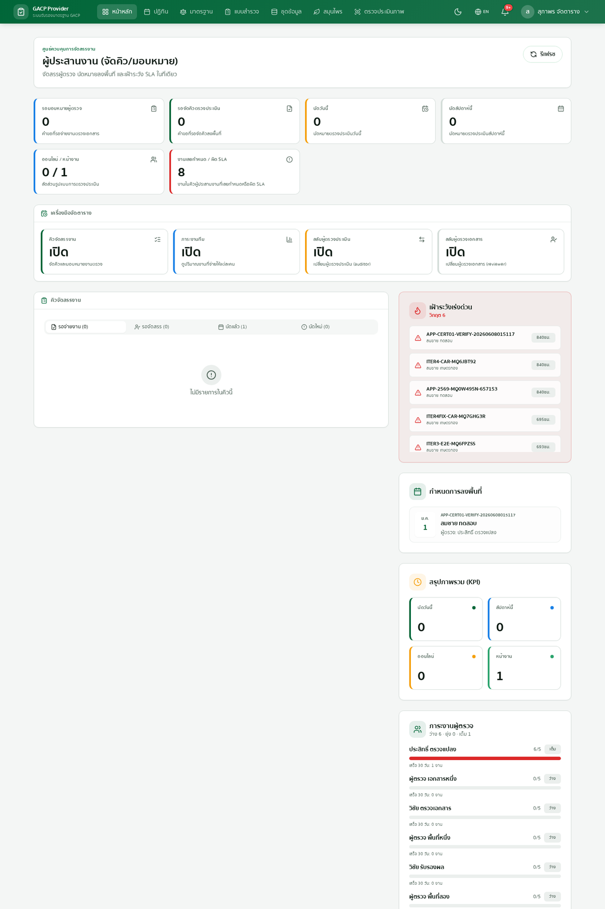
*ภาพที่ 43: หน้าผู้ประสานงาน รวมคิวจัดสรรงาน รายการเฝ้าระวังเร่งด่วน กำหนดการลงพื้นที่ และภาระงานของผู้ตรวจแต่ละคน*

1. ดูการ์ดตัวเลขด้านบน คืองานรอมอบหมาย รอจัดคิว นัดวันนี้ และนัดสัปดาห์นี้
2. ดูกล่อง เฝ้าระวังเร่งด่วน ซึ่งเรียงงานที่ค้างนานที่สุดไว้บนสุด
3. ดูกล่อง ภาระงานผู้ตรวจ ก่อนมอบหมาย เพื่อเลือกคนที่คิวว่าง แถบสีแดงคือคนที่งานเต็มมือแล้ว

### 9.2 คิวจัดตารางตรวจฟาร์ม

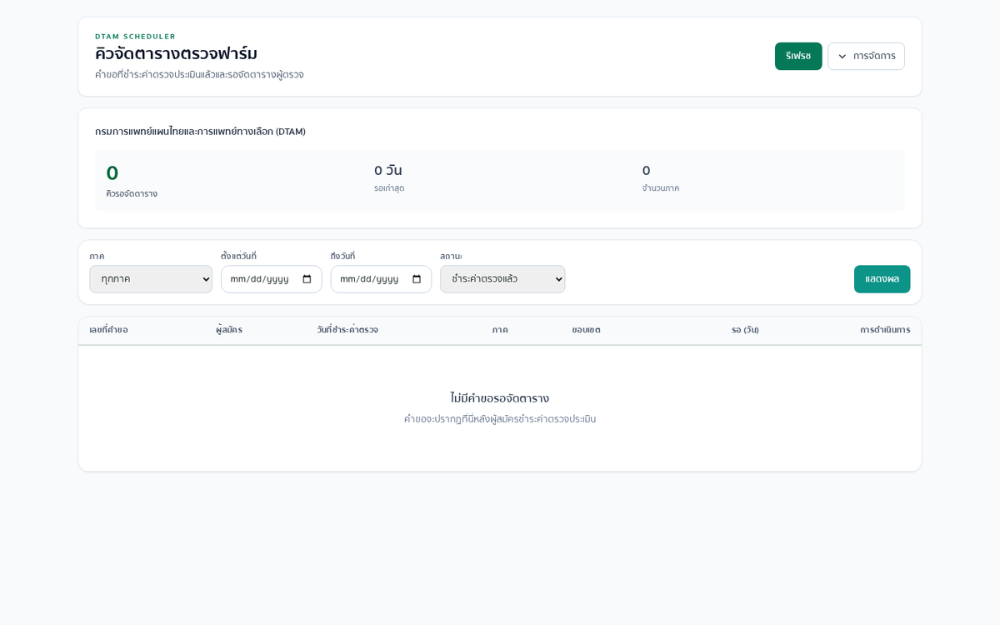
*ภาพที่ 44: คิวจัดตารางตรวจฟาร์ม รวมคำขอที่ชำระค่าตรวจประเมินแล้วและรอกำหนดวันนัด*

1. คำขอจะเข้าคิวนี้อัตโนมัติหลังเกษตรกรชำระค่าตรวจประเมินภาคสนามแล้ว
2. ใช้ตัวกรองภาคและช่วงวันที่ เพื่อวางแผนการเดินทางเป็นพื้นที่
3. กดรายการเพื่อกำหนดวันนัด ผู้ตรวจ และรูปแบบการตรวจ แล้วแจ้งนัดหมายให้เกษตรกรทราบทางโทรศัพท์หรือข้อความ

### 9.3 ปฏิทินนัดตรวจและการกระจายงาน

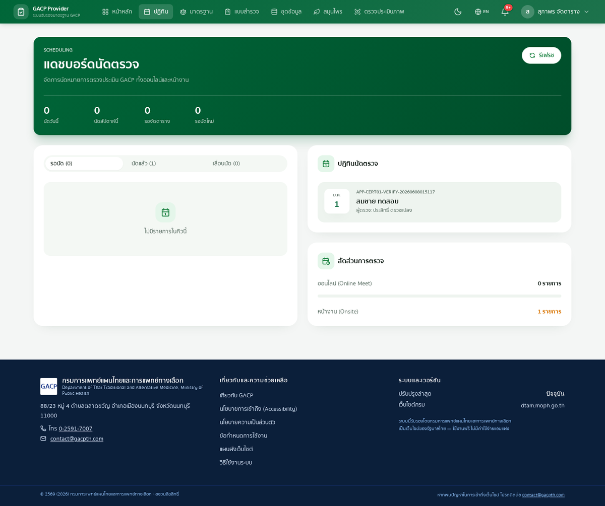
*ภาพที่ 45: แดชบอร์ดนัดตรวจ สรุปนัดวันนี้ นัดสัปดาห์นี้ และสัดส่วนการตรวจแบบออนไลน์กับลงพื้นที่*

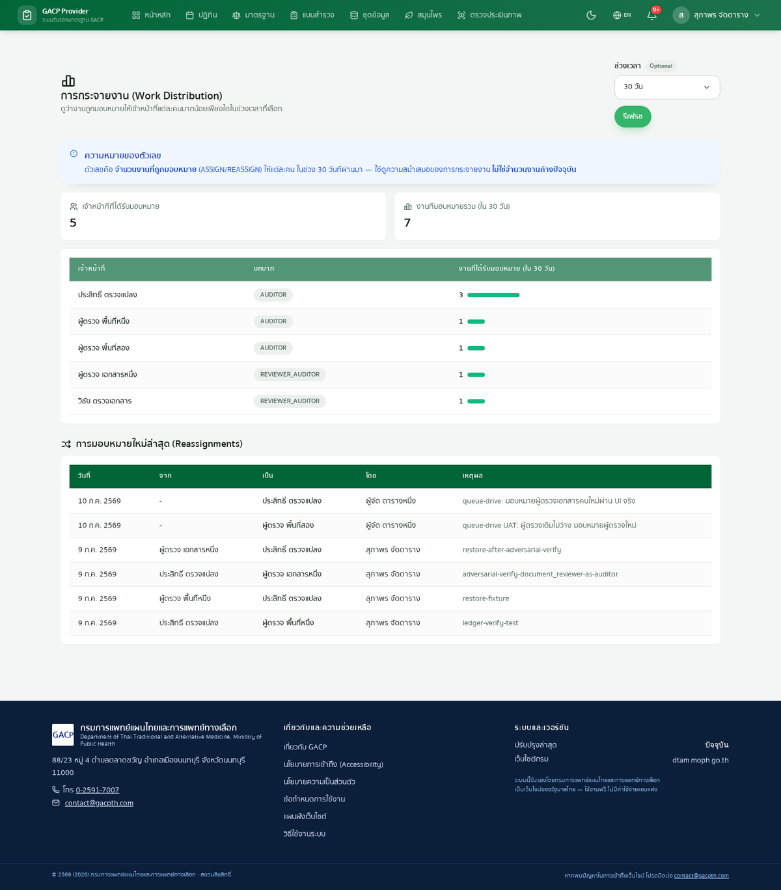
*ภาพที่ 46: หน้าการกระจายงาน ดูจำนวนงานที่มอบหมายให้เจ้าหน้าที่แต่ละคนย้อนหลัง พร้อมประวัติการโยกงาน*

1. ใช้หน้าปฏิทินตรวจสอบนัดหมายรวมของทีมก่อนกำหนดนัดใหม่ เพื่อไม่ให้ซ้อนกัน
2. ใช้หน้าการกระจายงานดูความสม่ำเสมอของการมอบหมายในช่วง 30 วัน
3. หากต้องเปลี่ยนตัวผู้ตรวจ ใช้เครื่องมือสลับผู้ตรวจในหน้าผู้ประสานงาน ระบบบันทึกประวัติการโยกงานพร้อมเหตุผลไว้ให้

---

## บทที่ 10  สำหรับเจ้าหน้าที่ผู้ตรวจประเมินภาคสนาม

ผู้ตรวจประเมินรับงานที่ผู้ประสานงานนัดหมายไว้ ลงพื้นที่หรือตรวจแบบออนไลน์ตามกำหนด แล้วบันทึกผลการตรวจเข้าระบบ

### 10.1 หน้าหลักผู้ตรวจประเมิน

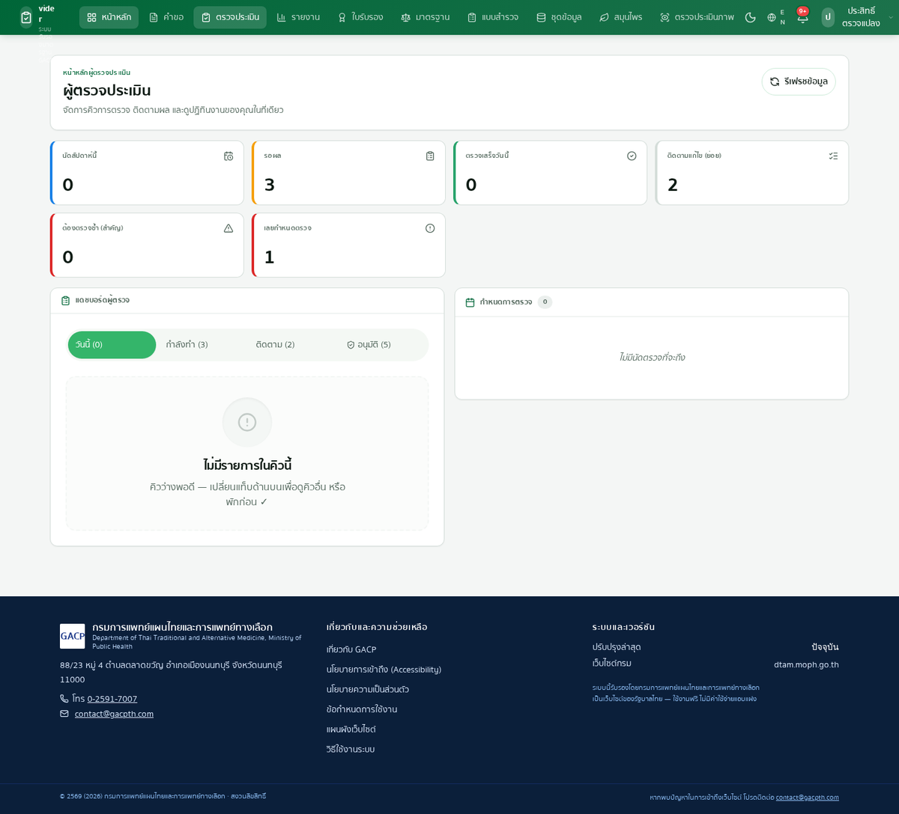
*ภาพที่ 47: หน้าหลักผู้ตรวจประเมิน สรุปนัดสัปดาห์นี้ งานรอผล งานติดตามแก้ไข และงานเลยกำหนด*

1. ดูการ์ดสรุปด้านบน โดยเฉพาะ นัดสัปดาห์นี้ และ เลยกำหนดตรวจ
2. ดูกล่อง กำหนดการตรวจ ด้านขวาสำหรับนัดที่กำลังจะถึง
3. เลือกแถบคิว วันนี้ กำลังทำ ติดตาม หรือ อนุมัติ เพื่อไล่ดูงานแต่ละกลุ่ม แล้วกดที่งานเพื่อเปิดบันทึกผลการตรวจ

ผลการตรวจมี 3 ทางคือ ผ่านการประเมิน พบข้อบกพร่องให้เกษตรกรส่งหลักฐานแก้ไข หรือไม่ผ่าน เมื่อบันทึกผ่านแล้วระบบจะเดินเรื่องออกใบรับรองให้อัตโนมัติ

### 10.2 งานใบรับรองที่เกี่ยวข้อง

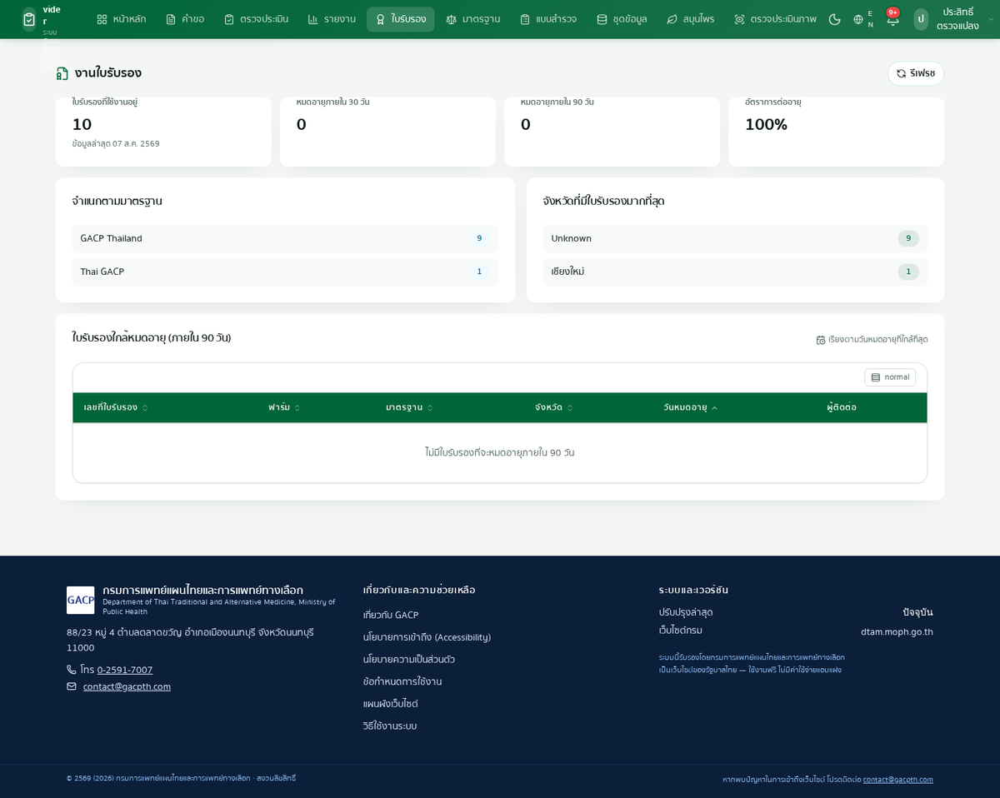
*ภาพที่ 48: หน้างานใบรับรอง สรุปใบรับรองที่ใช้งานอยู่ จำแนกตามมาตรฐานและจังหวัด พร้อมรายการใกล้หมดอายุ*

1. ใช้หน้านี้ติดตามใบรับรองที่ออกแล้วในภาพรวม และดูรายการที่จะหมดอายุภายใน 90 วัน
2. ใช้ประกอบการวางแผนตรวจต่ออายุร่วมกับผู้ประสานงาน

---

## บทที่ 11  สำหรับเจ้าหน้าที่การเงิน

เจ้าหน้าที่การเงินตรวจสลิปโอนเงินของเกษตรกร อนุมัติหรือปฏิเสธการชำระ กระทบยอดกับบัญชีธนาคาร และออกใบเสร็จรับเงิน

### 11.1 ตรวจสลิปและบัญชีรับเงิน

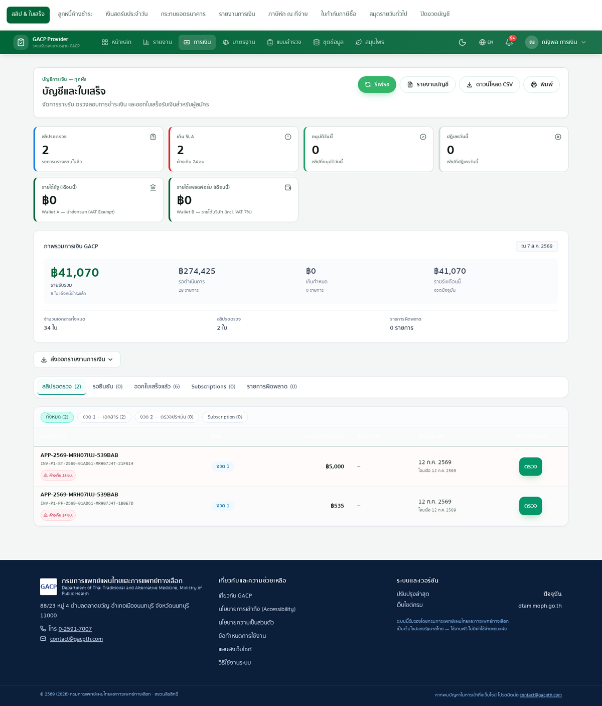
*ภาพที่ 49: หน้าบัญชีและใบเสร็จ สรุปสลิปรอตรวจ ยอดรับของฝั่งรัฐและแพลตฟอร์ม พร้อมตารางสลิปที่รอตรวจ*

1. ดูการ์ด สลิปรอตรวจ และ ค้างเกิน 24 ชั่วโมง เพื่อจัดลำดับงานก่อนหลัง
2. ในตารางด้านล่าง กดปุ่ม ตรวจ ท้ายรายการ เพื่อเปิดภาพสลิปเทียบกับยอดใบแจ้งหนี้
3. อนุมัติเมื่อยอดและบัญชีปลายทางถูกต้อง หรือปฏิเสธพร้อมเหตุผล ระบบจะแจ้งผลให้เกษตรกรทราบอัตโนมัติ

### 11.2 กระทบยอดธนาคารและใบเสร็จ

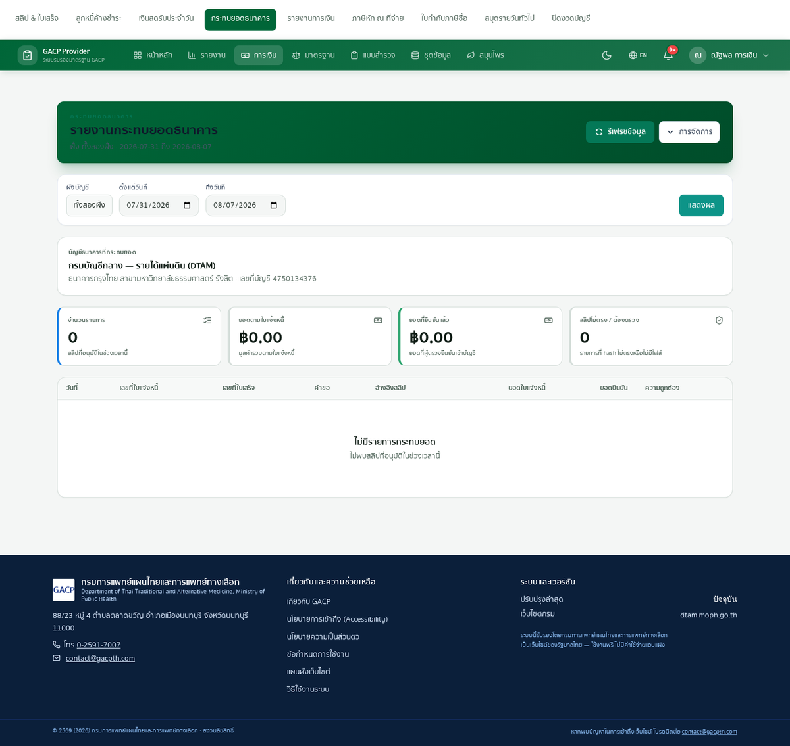
*ภาพที่ 50: หน้ารายงานกระทบยอดธนาคาร เทียบสลิปที่อนุมัติกับรายการเงินเข้าบัญชีในช่วงเวลาที่เลือก*

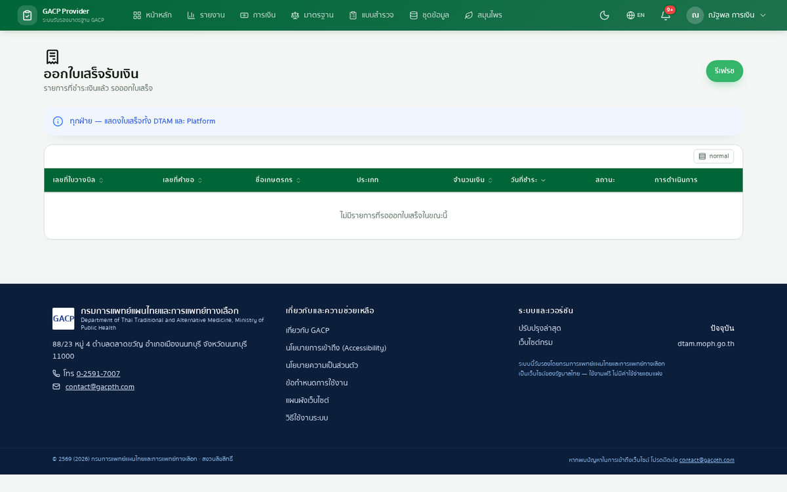
*ภาพที่ 51: หน้าออกใบเสร็จรับเงิน รวมรายการที่ชำระแล้วและรอออกใบเสร็จ*

1. เลือกฝั่งบัญชีและช่วงวันที่ แล้วกด แสดงผล เพื่อดูรายการกระทบยอด
2. รายการที่ยอดไม่ตรงหรือไม่พบไฟล์ จะแสดงในช่อง สลิปไม่ตรง ต้องตรวจ ให้ไล่ตรวจจนครบ
3. ที่หน้าออกใบเสร็จ กดออกใบเสร็จให้รายการที่ชำระสมบูรณ์แล้ว ระบบจะส่งใบเสร็จเข้าระบบของผู้ใช้งานให้เอง

---

## บทที่ 12  สำหรับผู้ดูแลระบบ

ผู้ดูแลระบบเห็นภาพรวมทุกส่วนงาน จัดการบัญชีผู้ใช้ ตรวจสอบบันทึกการใช้งาน และตั้งค่ากลางของระบบ บทนี้แสดงเฉพาะหน้าหลักที่ใช้บ่อย

### 12.1 ภาพรวมการบริหารระบบ

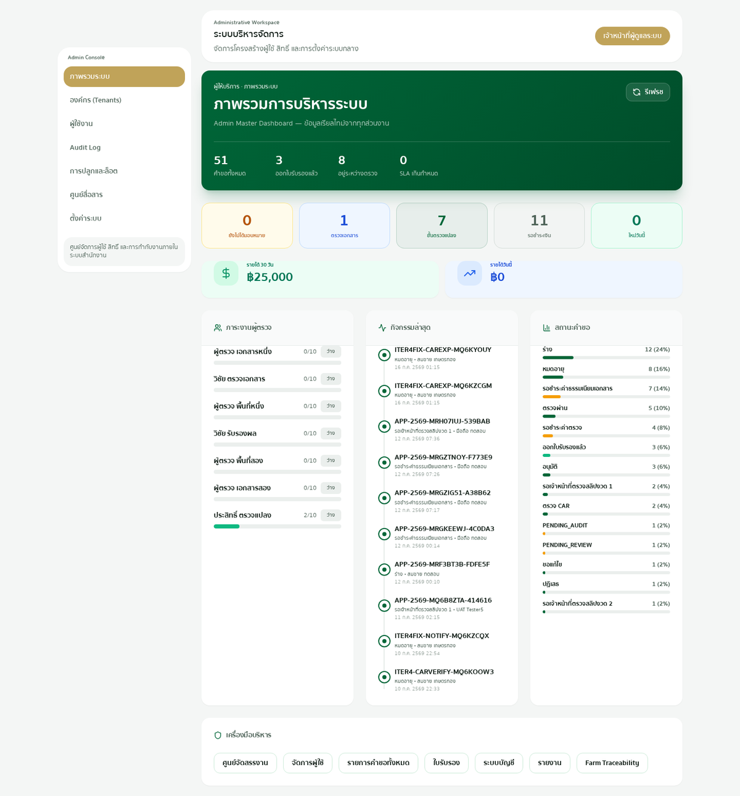
*ภาพที่ 52: แดชบอร์ดผู้ดูแลระบบ สรุปคำขอทั้งระบบ ภาระงานผู้ตรวจ กิจกรรมล่าสุด และสถานะคำขอทุกประเภท*

1. ดูตัวเลขรวมด้านบน คือคำขอทั้งหมด ออกใบรับรองแล้ว อยู่ระหว่างตรวจ และงานเกินกำหนด
2. ใช้กล่อง สถานะคำขอ ด้านขวาเพื่อเห็นคอขวดของกระบวนการ เช่น มีงานค้างในขั้นรอชำระเงินมากผิดปกติ
3. ปุ่มลัดด้านล่างพาไปยังเครื่องมือบริหารแต่ละส่วนได้โดยตรง

### 12.2 จัดการผู้ใช้งานระบบ

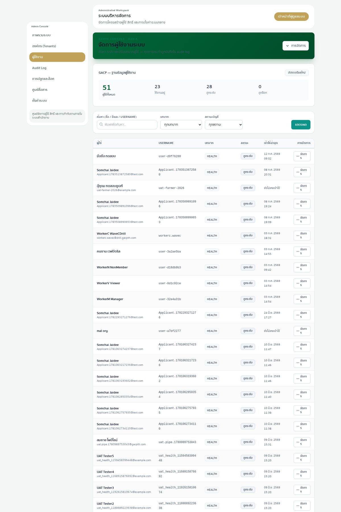
*ภาพที่ 53: หน้าจัดการผู้ใช้งาน ค้นหา กรองตามบทบาทและสถานะ และจัดการบัญชีรายคน*

1. ค้นหาด้วยชื่อ อีเมล หรือชื่อผู้ใช้ และกรองตามบทบาท เช่น เกษตรกร ผู้ตรวจเอกสาร ผู้ประสานงาน การเงิน หรือผู้ดูแล
2. กดปุ่ม จัดการ ท้ายรายชื่อ เพื่อแก้ไขข้อมูล ระงับการใช้งาน หรือปลดล็อกบัญชี

### 12.3 บันทึกการใช้งานระบบ (Audit Log)

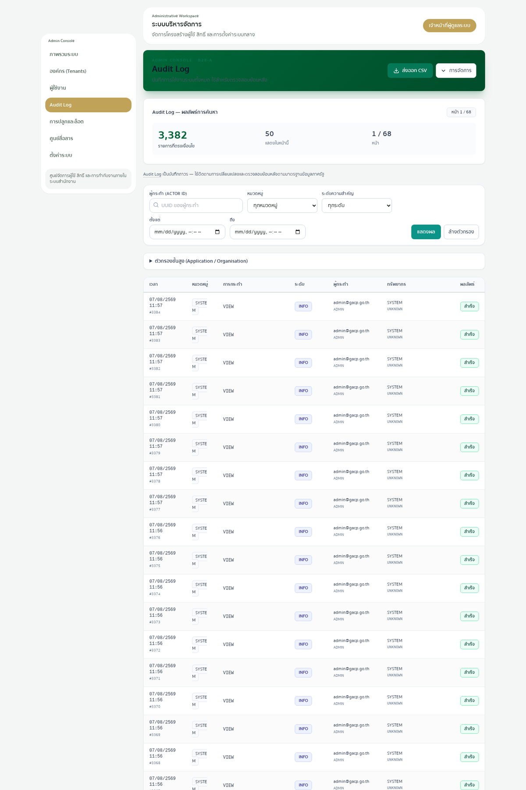
*ภาพที่ 54: หน้าบันทึกการใช้งาน เก็บทุกการกระทำในระบบ ค้นย้อนหลังและส่งออกเป็นไฟล์ได้*

1. กรองตามผู้กระทำ หมวดงาน ระดับความสำคัญ หรือช่วงวันที่ แล้วกด แสดงผล
2. ใช้ปุ่มส่งออกไฟล์เมื่อต้องนำข้อมูลไปตรวจสอบภายนอก

### 12.4 ใบรับรองทั้งระบบ

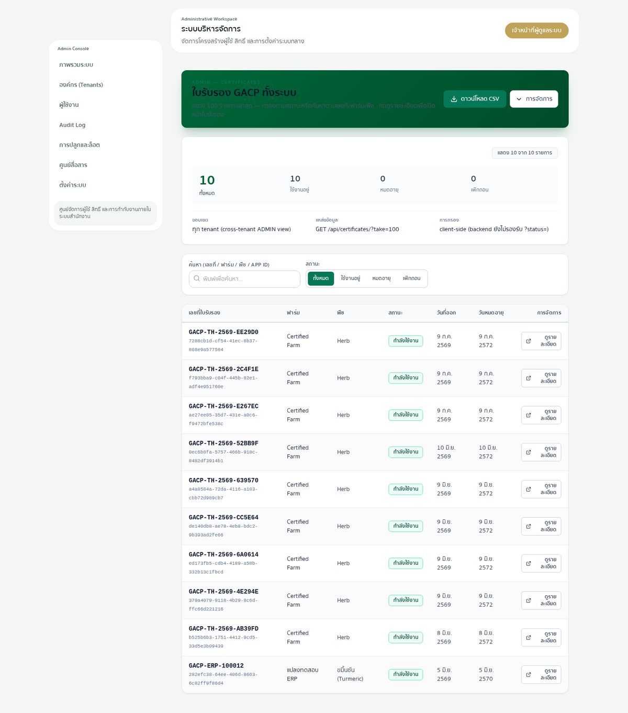
*ภาพที่ 55: หน้าใบรับรองทั้งระบบ ดูใบรับรองทุกใบของทุกหน่วยงาน พร้อมสถานะและวันหมดอายุ*

### 12.5 กำกับดูแลการปลูกและการตามสอบ

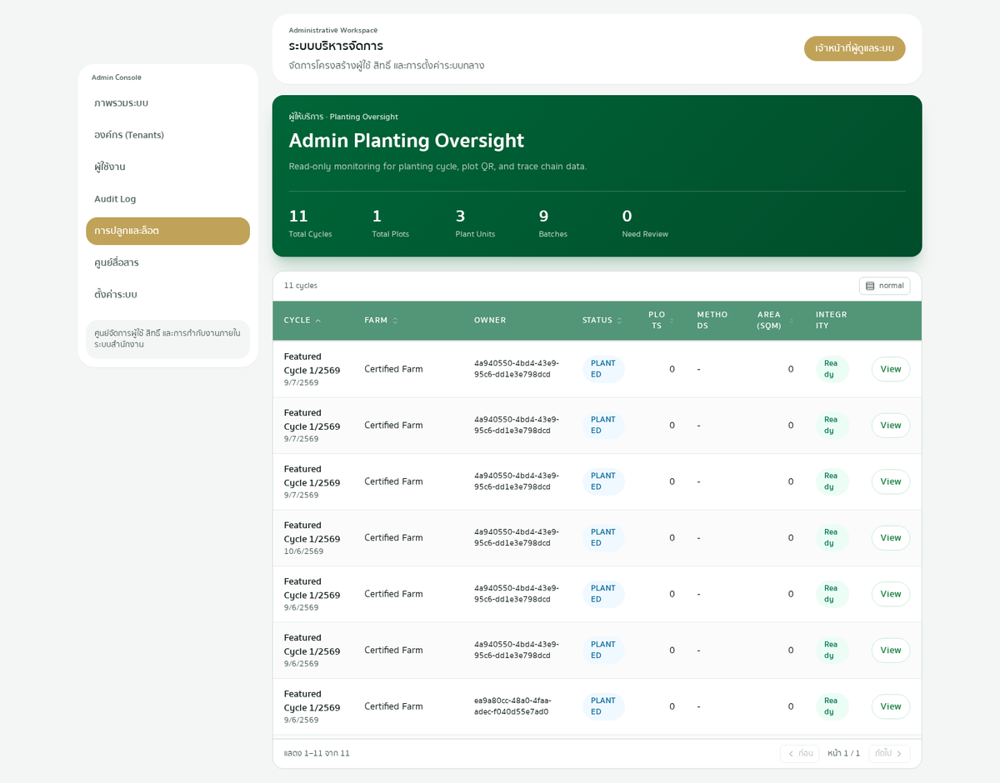
*ภาพที่ 56: หน้ากำกับดูแลการปลูก ดูรอบปลูก แปลง จำนวนต้น และล็อตผลผลิตของทุกฟาร์มแบบอ่านอย่างเดียว*

1. เข้าเมนู การปลูกและล็อต เพื่อดูรอบปลูกของทุกฟาร์มในระบบ พร้อมสถานะความพร้อมของข้อมูลตามสอบ
2. กดปุ่ม ดู ท้ายรายการ เพื่อเปิดรายละเอียดรอบปลูกนั้น หน้านี้ใช้ตรวจสอบเท่านั้น แก้ไขข้อมูลของเกษตรกรไม่ได้

### 12.6 ศูนย์การสื่อสาร

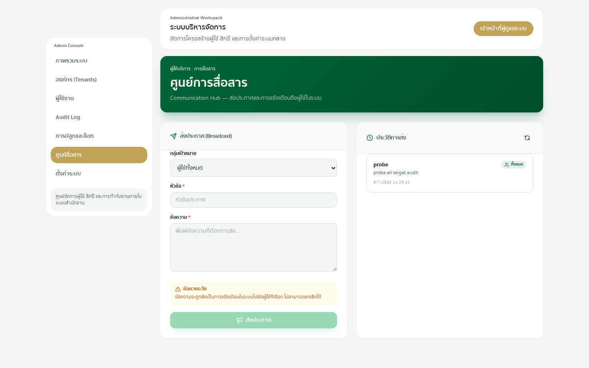
*ภาพที่ 57: ศูนย์การสื่อสาร ส่งประกาศถึงผู้ใช้ทุกคนหรือเฉพาะกลุ่ม พร้อมประวัติการส่ง*

1. เลือกกลุ่มเป้าหมาย พิมพ์หัวข้อและข้อความ แล้วกด ส่งประกาศ
2. ข้อความจะปรากฏเป็นการแจ้งเตือนในระบบของผู้ใช้ที่เลือก และยกเลิกไม่ได้หลังส่ง โปรดตรวจทานก่อนส่งทุกครั้ง

### 12.7 ตั้งค่าระบบ

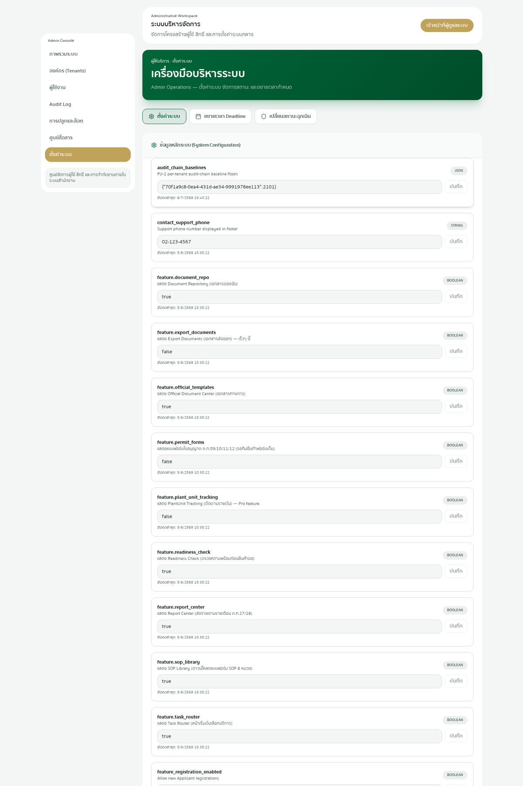
*ภาพที่ 58: หน้าตั้งค่าระบบ เปิดปิดความสามารถแต่ละส่วน ขยายเวลากำหนดส่ง และเปลี่ยนสถานะฉุกเฉินของระบบ*

หน้านี้มีผลกับผู้ใช้ทุกคนทันทีที่บันทึก ควรเปลี่ยนค่าเมื่อได้รับมอบหมายและบันทึกเหตุผลทุกครั้ง

---

## ภาคผนวก ก  การตรวจสอบใบรับรองสำหรับบุคคลทั่วไป

ผู้ซื้อ คู่ค้า หรือประชาชนทั่วไป ตรวจสอบใบรับรองได้เองโดยไม่ต้องมีบัญชี เพียงสแกนรหัสคิวอาร์บนใบรับรอง หรือเปิดหน้าตรวจสอบใบรับรองในเว็บไซต์แล้วกรอกหมายเลขใบรับรอง

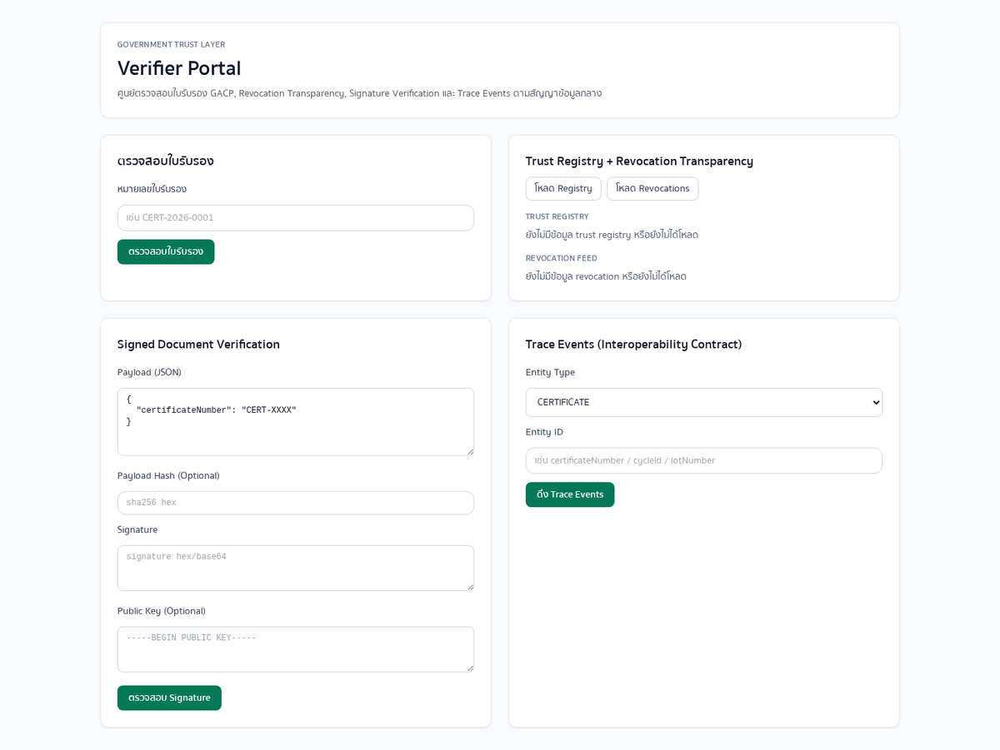
*ภาพที่ 59: หน้าตรวจสอบใบรับรอง กรอกหมายเลขใบรับรองแล้วกดตรวจสอบ*

1. สแกนรหัสคิวอาร์บนใบรับรองด้วยกล้องโทรศัพท์ ระบบจะเปิดหน้าผลการตรวจสอบให้ทันที
2. หรือเปิดหน้า ตรวจสอบใบรับรอง ในเว็บไซต์ แล้วพิมพ์หมายเลขใบรับรองในช่อง กดปุ่ม ตรวจสอบใบรับรอง
3. ผลที่แสดงคือสถานะใบรับรอง ชนิดพืช และวันออกกับวันหมดอายุ โดยไม่เปิดเผยข้อมูลส่วนตัวของเกษตรกร

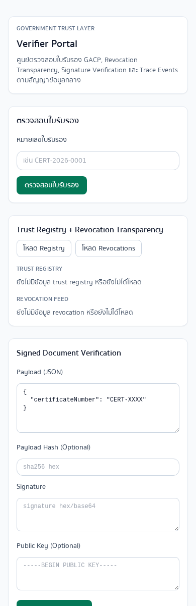
*ภาพที่ 60: หน้าตรวจสอบใบรับรองบนโทรศัพท์มือถือ เหมาะกับการสแกนหน้างาน*

เครื่องมือส่วนอื่นในหน้านี้ เช่น การตรวจลายเซ็นเอกสาร มีไว้สำหรับหน่วยงานที่เชื่อมข้อมูลกับระบบ ผู้ใช้ทั่วไปใช้เฉพาะช่องตรวจสอบใบรับรองก็เพียงพอ ส่วนการตรวจสอบสินค้าเป็นรายล็อต ดูหน้าตรวจสอบแหล่งที่มาในบทที่ 6

---

## ภาคผนวก ข  ฟีเจอร์ที่จะเปิดใช้เร็ว ๆ นี้ และส่วนที่อยู่ระหว่างพัฒนา

รายการต่อไปนี้ยังไม่เปิดให้ใช้งาน ณ วันจัดทำคู่มือ เมื่อเปิดใช้แล้วจะประกาศผ่านการแจ้งเตือนในระบบ และคู่มือฉบับถัดไปจะอธิบายวิธีใช้งาน

### จะเปิดใช้เร็ว ๆ นี้

- การเข้าสู่ระบบด้วยบัตรประชาชนผ่านแอป ThaID และการเชื่อมบัญชีกับหน่วยงานกลาง
- การตัดเงินออนไลน์แบบทันที (บัตร หรือพร้อมเพย์ที่ยืนยันการชำระอัตโนมัติ ไม่ต้องแนบสลิป)
- การชำระค่าธรรมเนียมต่ออายุใบรับรองภายในระบบ
- การแสดงวันนัดตรวจ เวลา และชื่อผู้ตรวจ บนหน้าจอของเกษตรกร (ปัจจุบันแจ้งทางโทรศัพท์หรือข้อความ)
- การตามสอบย้อนกลับครบทุกขั้นตั้งแต่รายต้นถึงล็อตผลผลิต (ปัจจุบันเปิดใช้เป็นบางส่วน ดูบทที่ 6)

### อยู่ระหว่างพัฒนา (ยังไม่มีให้ใช้ในระบบวันนี้)

- การส่งออกชุดเอกสารเป็นไฟล์รวม (เมนู เอกสารส่งออก)
- แบบฟอร์มใบอนุญาตเพิ่มเติมของทางราชการ
- การติดตามต้นพืชรายต้นแบบละเอียด (ส่วนขยาย)
- บริการสมาชิกรายเดือนสำหรับเครื่องมือเสริม
- การวิเคราะห์ภาพถ่ายแปลงปลูกอัตโนมัติ

หากพบปัญหาการใช้งาน ติดต่อกรมการแพทย์แผนไทยและการแพทย์ทางเลือก โทร 0-2591-7007 หรือช่องทางติดต่อในหน้า ช่วยเหลือ ของระบบ
