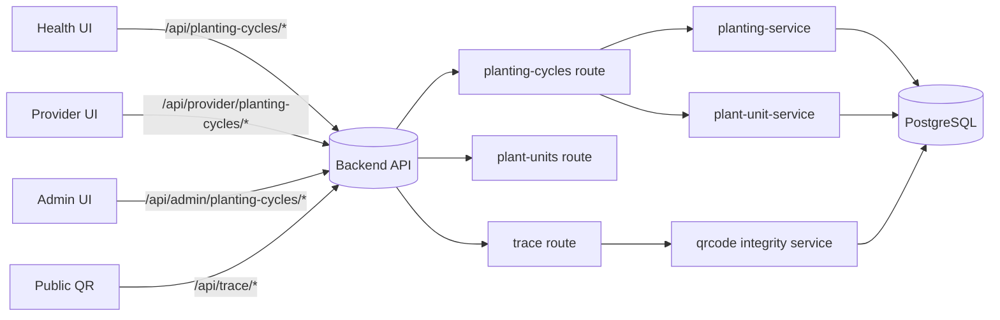
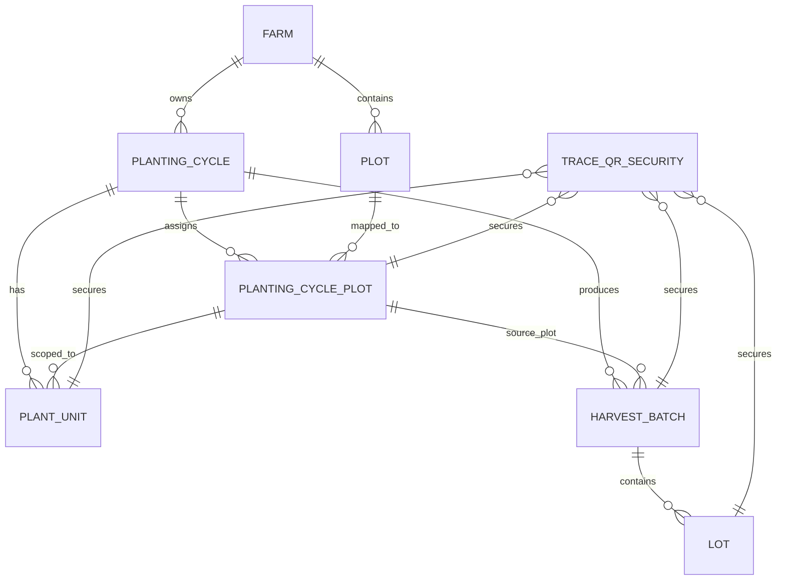

# Planting Runtime Blueprint (Health / Provider / Admin)

Last updated: 2026-02-15  
Scope: GACP cultivation only (planting -> harvest -> packaging -> transport)

## 1) Goals

- Keep planting flow simple for Applicants and auditable for provider/admin.
- Enforce trace chain: `Farm -> Plot -> Cycle -> Plant Unit -> Batch -> Lot`.
- Keep public QR privacy-safe while allowing verification.
- Ensure runtime uses canonical identity (`health`, `provider`) and canonical API routes.

## 2) Canonical user journeys

### J-01: Open cycle from certified farm
1. Health opens `/health/planting/new`.
2. Select certified farm and 1+ plots.
3. Define allocated area (sqm) and planned plant count per plot.
4. Save cycle (status `PLANTED`) with automation:
   - auto-generate plot-cycle QR for assigned plots
   - optional auto-generate units when enabled

### J-02: Generate and confirm plant units
1. Health opens `/health/planting/:id`.
2. Generate units (`/api/planting-cycles/:id/plant-units/generate`).
3. Confirm real planting in bulk (`/api/planting-cycles/:id/plant-units/confirm`).
4. Use filter by plot to operate in smaller batches.

### J-03: Plot-level QR trace
1. Generate plot QR (`/api/planting-cycles/:id/plot-qrs/generate`).
2. Public scans `/trace/plot-cycle/:qrCode`.
3. Public sees farm name, plot/cycle context, integrity and non-PII trace summary.
4. Authenticated user can drill down to plant list for that plot.

### J-04: Harvest with plot split
1. Health submits harvest by plot (`/api/planting-cycles/:id/harvest-batches`).
2. System creates one batch per cycle-plot.
3. Lots are created under each batch.
4. Trace always resolves lot back to specific plot and cycle.

## 3) Runtime architecture

## 4) Data chain (single source of truth)

## 5) Planting sitemap (web)

### Health
- `/health/planting`
- `/health/planting/new`
- `/health/planting/:id`
- `/health/planting/:id/activities`

### Provider (read-only)
- `/provider/planting`
- `/provider/planting/:id`

### Admin (read-only)
- `/admin/planting`
- `/admin/planting/:id`

### Public trace
- `/trace/plot-cycle/:qrCode`
- `/trace/batch/:batchId`
- `/trace/lot/:lotId`
- `/trace/plant/:qrCode`

## 6) UX guardrails (desktop-first ERP style)

- Primary actions max 3 per screen.
- Use progressive disclosure for heavy tables.
- Always show: "in table" vs "total actual" counts.
- Always provide plot filter before unit-level operations.
- Status wording must be explicit (no ambiguous generic labels).
- If data is legacy/over-plan, show explicit warning and reason.

## 7) Integrity policy

- `traceabilityReady = overPlanCount == 0 && unassignedCount == 0`
- Closed cycles with over-plan are flagged as `isLegacyDataIssue`.
- Legacy data is not auto-overwritten after harvest; preserve audit chain.
- Use runtime report:
  - `GET /api/planting-cycles/integrity/report`
  - `GET /api/planting-cycles/:id/integrity`
  - Script: `node apps/backend/scripts/report-planting-integrity.js`

## 8) Next hardening backlog

1. Mobile-first compact unit operations (quick mode by plot).  
2. Capacity widgets parity on provider/admin planting landing pages.  
3. Legacy data remediation assistant with non-destructive migration plan.
